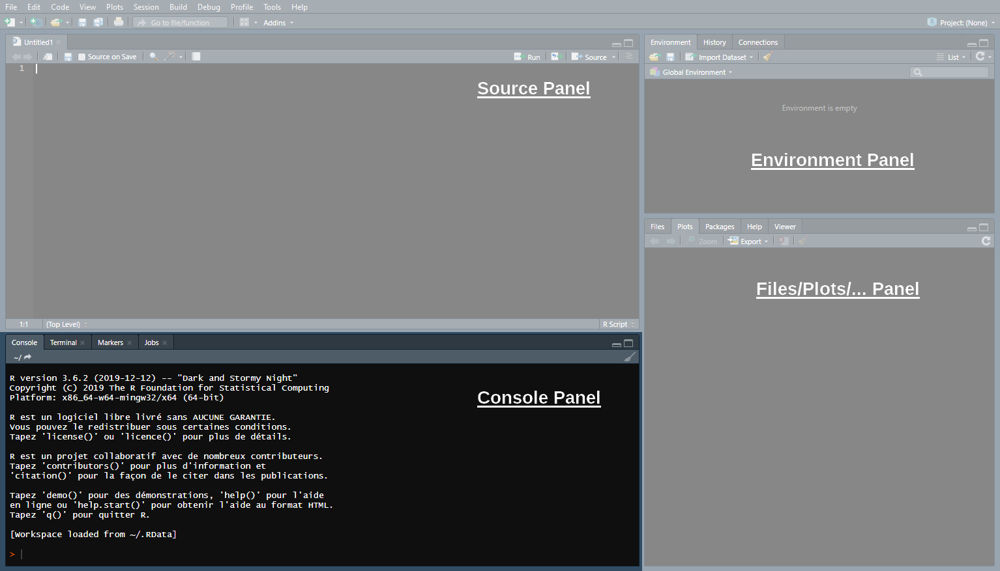
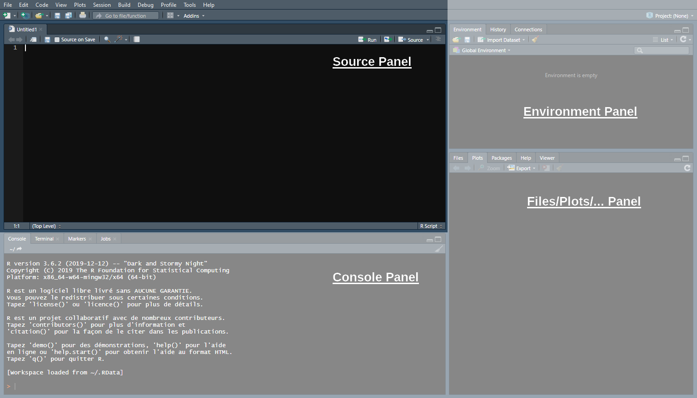
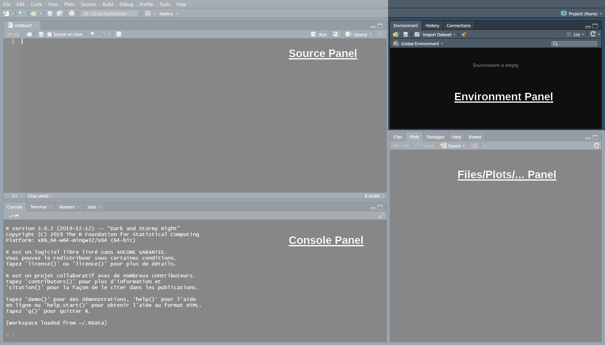
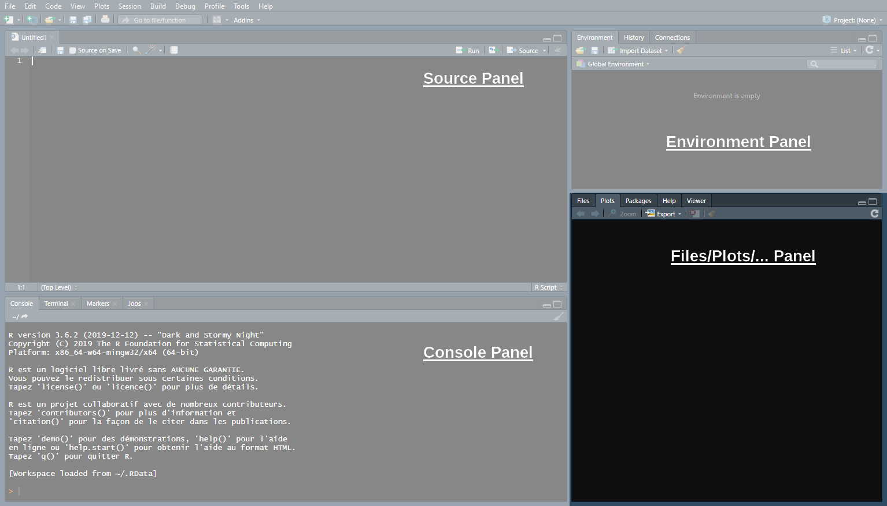
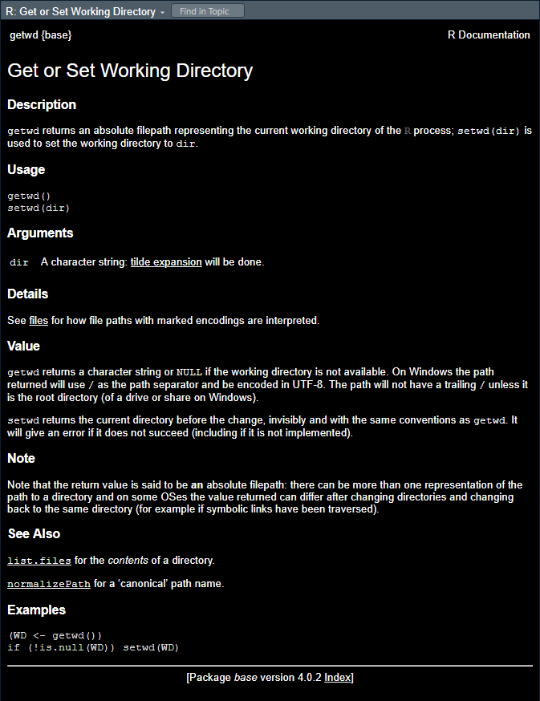
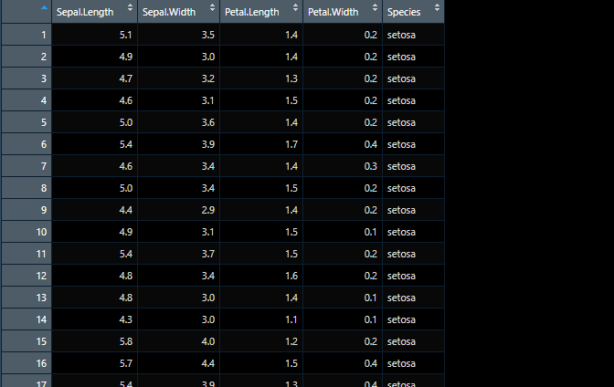
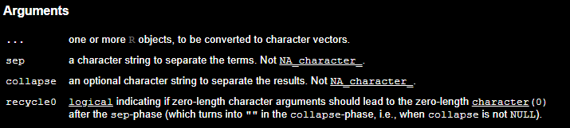
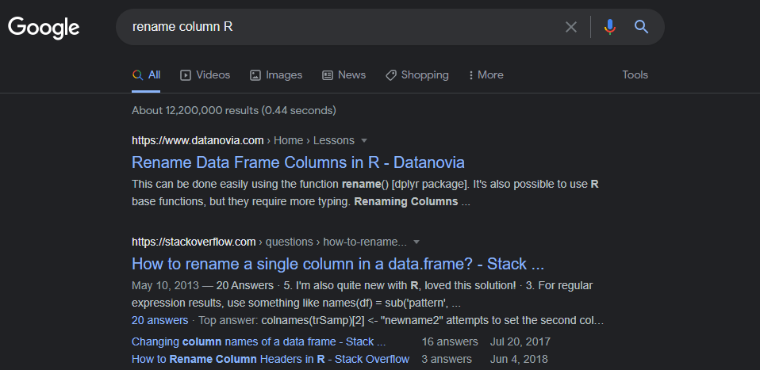
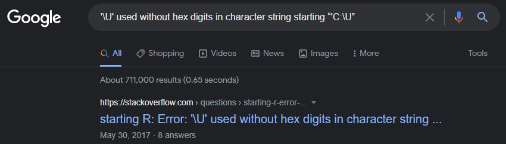

```{css, echo = F, eval = F}
body{background-color:black;filter:invert(1)}
```

```{r setup, include = FALSE}
source(paste0(getwd(), "/../source/style.R"))
stargazer <- stargazer::stargazer
theme_minimal <- theme_Rcourse
options(htmltools.dir.version = F)
knitr::opts_chunk$set(echo = T, message = F, warning = F, fig.align = "center", dpi = 300, out.width = "100%")
Sys.setenv(LANG = "en")
```

### Welcome to the course!

--

<p style = "margin-bottom:-.75cm;"></p>

.pull-left[

#### About me:

<p style = "margin-bottom:1.5cm;"></p>

<ul>
  <li style = "margin-bottom:.75cm;">PhD student at the Paris School of Economics</li>
  <li>I work primarily on:</li>
  <ul>
    <li>Intergenerational (income) mobility</li> 
    <li>Residential segregation</li>
    <li style = "margin-bottom:.75cm;">Discrimination</li>
  </ul>
  <li style = "margin-bottom:.75cm;">I do empirical research, so I use Econometrics and (R) programming on a daily basis</li>
  <li>You can reach me at <a href="mailto:louis.sirugue@psemail">louis.sirugue@psemail</a> for any question or comment about the course</li>
</ul>
]

--

.pull-right[

#### About the course:

<p style = "margin-bottom:5cm;"></p>

INCLUDE SYLLABUS ELEMENTS
]

---

### Objective of the course

```{r, echo = F, fig.width = 8, fig.height = 4.5, out.width = "82%"}
students_level <- tibble(x = 1:60, y = ((x-35)/15)^3, z = 3.2 + ((x-35)/20)^3) %>%
  pivot_longer(c(y, z), names_to = "var", values_to = "val") %>%
  mutate(ordervar = as.numeric(var == "z"),
         var = ifelse(var == "y", "Before the course (I assume)", "After the course (hopefully)")) 

ggplot(students_level %>% filter(var == "Before the course (I assume)"), 
       aes(x = x, y = val, color = reorder(var, ordervar))) + 
  geom_point() + xlab("You ranked by R programming skills") +
  scale_y_continuous(name = "R programming skills", limits = c(-12, 5.2)) +
  labs(color = " ") + theme(axis.text = element_blank(), axis.ticks = element_blank())
```
---

### Objective of the course

```{r, echo = F, fig.width = 8, fig.height = 4.5, out.width = "82%"}
ggplot(students_level, aes(x = x, y = val, color = reorder(var, ordervar))) + 
  geom_point() + xlab("You ranked by R programming skills") +
  scale_y_continuous(name = "R programming skills", limits = c(-12, 5.2)) +
  labs(color = " ") + theme(axis.text = element_blank(), axis.ticks = element_blank())
```

---

<h3>Let's delve into it!</h3>

.pull-left[
#### 1. Getting started 
<p style = "margin-bottom:-.5cm;">
 * 1.1. About R
 * 1.2. The R Studio IDE

#### 2. Classes of R objects
<p style = "margin-bottom:-.5cm;">
 * 2.1. Numeric values
 * 2.2. Character values
 * 2.3. Logical values
 * 2.4. Manipulate classes

#### 3. Vectors 
<p style = "margin-bottom:-.5cm;">
 * 3.1. Definition
 * 3.2. Operations with vectors
 * 3.3. Useful functions
 * 3.4. Classes of vectors
]

.pull-right[

#### 4. Datasets 
<p style = "margin-bottom:-.5cm;">
 * 4.1. What is a dataset
 * 4.2. Import and eyeball data
 * 4.3. Subset data
 
#### 5. Functions and packages
<p style = "margin-bottom:-.5cm;">
 * 5.1. Functions
 * 5.2. Packages

#### 6. A few words on learning R

#### 7. Wrap up!

]

---

<h3>Let's delve into it!</h3>

.pull-left[
#### 1. Getting started 
<p style = "margin-bottom:-.5cm;">
 * 1.1. About R
 * 1.2. The R Studio IDE
]

---

### 1. Getting started

#### 1.1. About R

 * R is a **programming language** and free software environment for **statistical computing and graphics**
 


<p style = "margin-bottom:-11cm;"></p>

--

<p style = "margin-bottom:.75cm;"></p>

<ul>
 <li style = "margin-bottom:.25cm;">The R language is widely (and increasingly) used in <b>academic and non-academic research</b> in fields like:</li>
   <ul>
     <li>Economics</li>
     <li>Statistics</li>
     <li>Biostats</li>
   </ul>
</ul>

--

<p style = "margin-bottom:.75cm;"></p>

<ul>
 <li style = "margin-bottom:.25cm;">Things you can do with R:</li>
   <ul>
     <li><a href="https://louissirugue.github.io/data-analysis-course/project/example.html">Reports</a></li>
     <li><a href="https://www.r-graph-gallery.com/bubble_chart_interactive_ggplotly.html">Nice plots</a></li>
     <li><a href="https://louissirugue.github.io/intro_to_R/home.html">All the material of this course</a></li>
     <li><a href="https://pubs.aeaweb.org/doi/pdfplus/10.1257/app.20200447">Academic research</a></li>
     <li><a href="https://www.kaggle.com/xavierconort">Win kaggle competitions</a></li>
     <li><a href="https://vac-lshtm.shinyapps.io/ncov_tracker/?_ga=2.29922175.1739025613.1656421238-871875772.1628005923">Interactive data visualization</a></li>
     <li><a href="https://www.data-to-art.com/">Art</a></li>
   </ul>
</ul>
 
---

### 1. Getting started

#### 1.2. The R Studio IDE

<center>

</center>
 
---

### 1. Getting started

#### 1.2. The R Studio IDE

<center>

</center>

&#10140; <b>The Console panel</b>

<ul>
  <li>This is where you <b>communicate with R</b>
  <ul>
    <li>You can write instructions after the <b>></b>, <b>press enter</b> and R will <b>execute</b></li>
    <li>Try with <b>1+1:</b></li>
  </ul>
</ul>

--

```{r}
1+1
```
 
---

### 1. Getting started

#### 1.2. The R Studio IDE

<center>

</center>

&#10140; <b>The Source panel</b>

<ul>
  <li>This is where you <b>write and save your code</b> (File > New File > R Script)</li>
  <ul>
    <li><b>Separate</b> different commands with a <b>line break</b></li>
    <li>The <b>#</b> symbol allows to <b>comment</b> your code</li>
    <li>Everything after <b>#</b> will be <b>ignored</b> by R until the next line break</li>
  </ul>
</ul>

--

```{r, results='hide'}
1+1 # Do not put 2+2 on the same line, press enter to go to next line 
2+2
```
 
---

### 1. Getting started

#### 1.2. The R Studio IDE

<center>

</center>

&#10140; <b>The Source panel</b>

<ul>
  <li>To send the command from the source panel to the console panel:</li>
  <ol>
    <li><b>Highlight</b> the lines you want to execute</li>
    <li>Press <b>crtl + enter</b></li>
  </ol>
</ul>

--

<ul><li>If you do not highlight anything the line of code where your cursor stands will be executed</li></ul>

--

<ul><li>Check the console to see the output of your code</li></ul>
 
---

### 1. Getting started

#### 1.2. The R Studio IDE

<center>

</center>

&#10140; <b>The Environment panel</b>

<ul>
  <li>Data analysis requires manipulating datasets, vectors, functions, etc.</li>
  <ul>
    <li>These <b>elements are stored in the environment</b> panel</li>
  </ul>
</ul>

--

 * For instance we can assign a value to an object using `<-`

```{r}
x <- 1
```

--

<center><i><b> &#10140; You now have an object called 'x' in your environment, which takes the value 1</b></i></center>

---

### 1. Getting started

#### 1.2. The R Studio IDE

<center>

</center>

&#10140; <b>The Environment panel</b>

.pull-left[

 * Now that the object `x` is stored in your environment, you can use it:

```{r}
x + 1
```

]

--

.pull-right[

 * You can also modify that object at any point:

```{r}
x <- x + 1
x
```

]

---

### 1. Getting started

#### 1.2. The R Studio IDE

<center>

</center>

&#10140; <b>The Files/Plots/... panel</b>

 * In this panel we'll mainly be interested in the following 4 tabs

--
<ul style = "margin-top:1em;"><li><b>Files:</b> Shows your working directory</li></ul>
--
<ul style = "margin-top:1em;"><li><b>Plots:</b> Where R returns plots</li></ul>
--
<ul style = "margin-top:1em;"><li><b>Packages:</b> A library of tools that we can load if needed</li></ul>
--
<ul style = "margin-top:1em;"><li><b>Help:</b> Where to look for documentation on R functions</li></ul>

---

### 1. Getting started

#### 1.2. The R Studio IDE

<center>

</center>   

&#10140; <b>The Files/Plots/... panel</b>

 *  Enter `?getwd()` in the console to see what a **help file** looks like

--
<ul style = "margin-top:1em;"><li>It <b>describes</b> what the command does</li></ul>
--
<ul style = "margin-top:1em;"><li>It <b>explains</b> the different parameters of the command</li></ul>
--
<ul style = "margin-top:1em;"><li>It <b>gives examples</b> of how to use the command</li></ul>

---

### 1. Getting started

#### 1.2. The R Studio IDE


&#10140; <b>The Files/Plots/... panel</b>

 *  Enter `?getwd()` in the console to see what a **help file** looks like

<ul><ul><li>It <b>describes</b> what the command does</li></ul></ul>
<ul><ul><li>It <b>explains</b> the different parameters of the command</li></ul></ul>
<ul><ul><li>It <b>gives examples</b> of how to use the command</li></ul></ul>



---

<h3>Overview</h3>

.pull-left[
#### 1. Getting started &#10004;
<p style = "margin-bottom:-.5cm;">
 * 1.1. About R
 * 1.2. The R Studio IDE

#### 2. Classes of R objects
<p style = "margin-bottom:-.5cm;">
 * 2.1. Numeric values
 * 2.2. Character values
 * 2.3. Logical values
 * 2.4. Manipulate classes

#### 3. Vectors 
<p style = "margin-bottom:-.5cm;">
 * 3.1. Definition
 * 3.2. Operations with vectors
 * 3.3. Useful functions
 * 3.4. Classes of vectors
]

.pull-right[

#### 4. Datasets 
<p style = "margin-bottom:-.5cm;">
 * 4.1. What is a dataset
 * 4.2. Import and eyeball data
 * 4.3. Subset data
 
#### 5. Functions and packages
<p style = "margin-bottom:-.5cm;">
 * 5.1. Functions
 * 5.2. Packages

#### 6. A few words on learning R

#### 7. Wrap up!

]

---

<h3>Overview</h3>

.pull-left[
#### 1. Getting started &#10004;
<p style = "margin-bottom:-.5cm;">
 * 1.1. About R
 * 1.2. The R Studio IDE

#### 2. Classes of R objects
<p style = "margin-bottom:-.5cm;">
 * 2.1. Numeric values
 * 2.2. Character values
 * 2.3. Logical values
 * 2.4. Manipulate classes
]

---

### 2. Classes of R objects

<p style = "margin-bottom:1.5cm;">

<center><b>&#10140; There are 3 main classes of R objects</b></center>

--

.pull-left[

<p style = "margin-bottom:1cm;"></p>

<ul style = "margin-left:1cm;">
  <li><b>Numeric values:</b></li>
  <ul>
    <li>42</li>
    <li>-10^3</li>
    <li>2.6879098767</li>
  </ul>
</ul>

<p style = "margin-bottom:1cm;"></p>

<ul style = "margin-left:1cm;">
  <li><b>Character values:</b></li>
  <ul>
    <li>A</li>
    <li>Hello world</li>
    <li>PM2.5</li>
  </ul>
</ul>

<p style = "margin-bottom:1cm;"></p>

<ul style = "margin-left:1cm;">
  <li><b>Logical values:</b></li>
  <ul>
    <li>TRUE (<i>or equivalently</i> T)</li>
    <li>FALSE (<i>or equivalently</i> F)</li>
  </ul>
</ul>

]

--

.pull-right[

<p style = "margin-top:2.5cm;margin-left:-.75cm;">The class of an object is a <b>key attribute</b>:</p>

<ul style = "margin-left:-2.75cm;">
  <li>Different types of operations are available for different classes of object</li>
</ul>

<ul style = "margin-left:-2.75cm;">
  <li>Objects of different classes may react differently to a same operation</li>
</ul>

<ul style = "margin-left:-2.75cm;">
  <li>Class mistakes is a common source of programming errors</li>
</ul>

]

---

### 2. Classes of R objects

#### 2.1. Numeric values

<center><b>Basic operations with numeric values:</b></center>

--

.pull-left[
 
```{r}
2 + 3 # Addition
```

```{r}
2 - 3 # Subtraction
```

```{r}
2 * 3 # Multiplication
```

```{r}
2 / 3 # Division
```

]

--

.pull-right[

```{r}
2 ^ 2 # Exponent
```

```{r}
4 ^ (1/2) # Root
```

<p style = "margin-bottom:1.5cm;"></p>

 * Store the result of a computation in an object:

```{r}
result <-((2 + 2)^(2 / (2 * 2))) - 2
result
```

]

---

### 2. Classes of R objects

#### 2.2. Character values

<center><b>Character values need to be surrounded by quotation marks (' or ")</b></center>

--

```{r}
language <- "R"
language
```

--

<p style = "margin-bottom:.75cm;"></p>

<center><b>Without quotation marks, R will think that you refer to an object</b></center>

```{r, error=TRUE}
R
```

--

<p style = "margin-bottom:1cm;"></p>

<center><b>Characters are not necessarily letters</b></center>

```{r}
character_string <- "R'{ç^*µ,,,_hi3"
```

---

### 2. Classes of R objects

#### 2.2. Character values

<center><b>Useful functions with characters</b></center>

<p style = "margin-bottom:1cm;"></p>

.pull-left[

<center><b>Combining strings</b></center>

```{r}
paste("Hello", "world") 
```

<p style = "margin-bottom:1cm;"></p>

```{r}
paste("a", "b", "c", sep = "-") 
```

<p style = "margin-bottom:1cm;"></p>

```{r}
paste0("a", "b", "c") 
```

]

--

.pull-right[

<center><b>Splitting strings</b></center>

```{r}
substr("abcdefghijklmnopqrstuvwxyz", 3, 5)
```

<p style = "margin-bottom:1cm;"></p>

```{r}
nchar("Hello world")
```

<p style = "margin-bottom:1cm;"></p>

```{r}
substr("Hello world", 5, nchar("Hello world"))
```

]

---

### 2. Classes of R objects

#### 2.3. Logical values

.pull-left[

A logical value/**Boolean**, is a value that can be either:
 
<p style = "margin-bottom:1.25cm;"></p>
 
<ul><ul><li><b>TRUE</b> (can be abbreviated as <b>T</b>)</li></ul></ul>

```{r}
T
```

<p style = "margin-bottom:1.25cm;"></p>

<ul><ul><li>or <b>FALSE</b> (can be abbreviated as <b>F</b>)</li></ul></ul>

```{r}
F
```

]
 
--

.pull-right[
 
```{r}
2 + 2 == 4 # Equality
```

<p style = "margin-bottom:.75cm;"></p>

```{r}
2 + 2 != 4 # Inequality
```

<p style = "margin-bottom:.75cm;"></p>

```{r}
1 > 2 # Strictly lower/greater
```

<p style = "margin-bottom:.75cm;"></p>

```{r}
2 <= 2 # Weakly lower/greater
```

]

---

### 2. Classes of R objects

#### 2.3. Logical values


.pull-left[

<center><b>And (&) / or (|)</b></center>
 
```{r}
(1 == 1) & (1 == 2) #AND
```

```{r}
(1 == 1) | (1 == 2) #OR
```

```{r}
1 == 1 | (2 == 2 & 1 == 2) #Parentheses matter
```

```{r}
(1 == 1 | 2 == 2) & 1 == 2 #Parentheses matter
```

]

--

.pull-right[

<center><b>Opposite (!)</b></center>
 
```{r}
is.numeric(1)
```

```{r}
!is.numeric(1)
```

```{r}
3 < 2
```

```{r}
!3 < 2
```

]

---

### 2. Classes of R objects

#### 2.4. Manipulate classes

--

<ul>
  <li>It is important to <b>keep in mind the class</b> of the object you are working with because they work differently</li>
  <ul>
    <li>For instance, you can add two numeric values together but not two characters</li>
  </ul>
</ul>

--

<ul>
  <li>You can <b>find the class</b> of an object by hovering your mouse over its name in the environment panel</li>
  <ul>
    <li>You can also use the <b>class()</b> function</li>
  </ul>
</ul>

--

```{r}
class(2)
```

--

```{r}
class("a")
```

--

```{r}
class(FALSE)
```

---

### 2. Classes of R objects

#### 2.4. Manipulate classes

<ul><li>You can <b>change the class</b> of an object using functions of the form <b>as.[character/numeric/logical]()</b></li></ul>

--

<p style = "margin-bottom:.5cm;"></p>

<center><b>Class conversion table:</b></center>

```{r, echo = F}
tibble(` ` = c("<b>numeric</b>", 
               "<b>character</b>", 
               "<b>logical</b>"),
       `as.numeric()` = c("No effect", 
                          'Converts strings of numbers <br> into numeric values <p style = "margin-bottom:-.25cm;"></p> Returns NA if characters in the string',
                          'Returns 1 if TRUE  <p style = "margin-bottom:-.25cm;"></p> Returns 0 if FALSE'),
       `as.character()` = c("Converts numeric values <br> into strings of numbers", 
                            "No effect", 
                            'Returns "TRUE" if TRUE <p style = "margin-bottom:-.25cm;"></p> Returns "FALSE" if FALSE'),
       `as.logical()` = c('Returns TRUE if != 0 <p style = "margin-bottom:-.25cm;"></p> Returns FALSE if 0', 
                          'Returns TRUE if "T" or"TRUE" <br> Returns FALSE if "F" or "FALSE" <p style = "margin-bottom:-.25cm;"></p> Returns NA otherwise', 
                          "No effect")) %>%
  kable(., caption = "", align = 'lccc', escape = F)
```

<p style = "margin-bottom:1cm;"></p>

<center><b>NA</b> stands for <i>'Not Available'</i>, it corresponds to a <b>missing value</b></center>

---

### 2. Classes of R objects

#### 2.4. Manipulate classes

<center><b>Some examples</b></center>

--

.pull-left[

```{r}
as.numeric("2022")
```

```{r}
as.numeric("2022-2023")
```

```{r}
as.numeric(T)
```

```{r}
as.numeric(FALSE)
```

]

--

.pull-right[

```{r}
as.character(2022)
```

```{r}
as.logical(0)
```

```{r}
as.logical(1)
```

```{r}
as.logical(-.75)
```

]

---

<h3>Overview</h3>

.pull-left[
#### 1. Getting started &#10004;
<p style = "margin-bottom:-.5cm;">
 * 1.1. About R
 * 1.2. The R Studio IDE

#### 2. Classes of R objects &#10004;
<p style = "margin-bottom:-.5cm;">
 * 2.1. Numeric values
 * 2.2. Character values
 * 2.3. Logical values
 * 2.4. Manipulate classes

#### 3. Vectors 
<p style = "margin-bottom:-.5cm;">
 * 3.1. Definition
 * 3.2. Operations with vectors
 * 3.3. Useful functions
 * 3.4. Classes of vectors
]

.pull-right[

#### 4. Datasets 
<p style = "margin-bottom:-.5cm;">
 * 4.1. What is a dataset
 * 4.2. Import and eyeball data
 * 4.3. Subset data
 
#### 5. Functions and packages
<p style = "margin-bottom:-.5cm;">
 * 5.1. Functions
 * 5.2. Packages

#### 6. A few words on learning R

#### 7. Wrap up!
]

---

<h3>Overview</h3>

.pull-left[
#### 1. Getting started &#10004;
<p style = "margin-bottom:-.5cm;">
 * 1.1. About R
 * 1.2. The R Studio IDE

#### 2. Classes of R objects &#10004;
<p style = "margin-bottom:-.5cm;">
 * 2.1. Numeric values
 * 2.2. Character values
 * 2.3. Logical values
 * 2.4. Manipulate classes

#### 3. Vectors 
<p style = "margin-bottom:-.5cm;">
 * 3.1. Definition
 * 3.2. Operations with vectors
 * 3.3. Useful functions
 * 3.4. Classes of vectors
]

---

### 3. Vectors

#### 3.1. Definition

<ul>
  <li>In R, a vector is a <b>sequence of objects that have the same class</b></li>
  <ul>
    <li>To create a vector you should list its elements separated by commas inside <b>c()</b></li>
  </ul>
</ul>

--

```{r}
months <- c("January", "February", "March", "April", "May", "June", "July", 
            "August", "September", "October", "November", "December")
```

--

 * Vectors are <b>ordered</b>, you can recover elements of a vector using their position in the sequence using `[]`

--

```{r}
months[3]
```

--

 * Conversely, the function `match()` allows you to recover the position of specific elements in a vector:

--

```{r}
match(c("August", "December"), months)
```

---

### 3. Vectors

#### 3.2. Operations with vectors

 * Numeric operations apply to every element of the vector:

```{r}
4 + c(10, 20, 30)
```

--

```{r}
c(1, 2, 3) * 4
```

--

```{r}
4 ^ c(1, 2, 3)
```

--

```{r}
c(1, 2, 3) ^ 4
```

---

### 3. Vectors

#### 3.3. Useful functions

<p style = "margin-bottom:1cm;"></p>

 * The `length()` function for the <b>number of elements</b> in a vector

--

```{r}
length(months)
```

--

<p style = "margin-bottom:2cm;"></p>

 * The `rep()` function for <b>repeating a vector</b>

--

.pull-left[

<ul><ul><li>Vector-wise:</li></ul></ul>

```{r}
rep(c(1, 2, 3), 2)
```

]

--

.pull-right[
<ul><ul><li>Or element-wise:</li></ul></ul>

```{r}
rep(c(1, 2, 3), each = 2)
```
]

---

### 3. Vectors

#### 3.3. Useful functions

<p style = "margin-bottom:1cm;"></p>

 * The `seq()` function for <b>sequences</b>

--

```{r}
seq(0, 100, 10)
```
--
```{r}
seq(2, 3, .2)
```

--

<p style = "margin-bottom:1.5cm;"></p>

 * Sequences of <b>consecutive integers</b> can be easily produced using `:`
 
```{r}
1:10
```

---

### 3. Vectors

#### 3.3. Useful functions

 * The `paste()` function also applies to all the elements of the vector

--

```{r}
paste0("A", 1:5) 
```

--

<p style = "margin-bottom:1.5cm;"></p>

 * And can merge the elements of a vector with the `collapse` argument

--

```{r}
sentence <- c("Lorem", "ipsum", "dolor", "sit", "amet")
sentence
paste0(sentence, collapse = " ")
```

---

### 3. Vectors

#### 3.4. Classes of vectors

 * As the elements of a vector should be of the same class, the class of a vector is always that of its elements:

```{r}
class(c(1, 2, 3))
```

<p style = "margin-bottom:1.25cm;">

--

<ul>
  <li>But there is <b>another class</b> you should know for vectors: the <b>factor</b> class</li>
  <ul>
    <li>It's made for vectors with numeric values that can't be interpreted but simply indicate a <b>group/category</b></li>
  </ul>
</ul>

<p style = "margin-bottom:1cm;">

--

<ul>
  <li>Consider for instance the following age vectors:</li>
  <ol>
    <li>Vector age1 indicates the actual age of an individual, it should be of class numeric</li>
    <li>Vector age2 indicates an age group (1 = 1 to 10, 2 = 10 to 20, ...) it should be of class factor</li>
  </ol>
</ul>

<p style = "margin-bottom:1cm;">

***&#10140; In vector age2, numbers don't mean anything, they're just group indicators and R should interpret it as such***

---

### 3. Vectors

#### 3.4. Classes of vectors

 * R understands that multiplying the values of a factor by 2 makes no sense
 
--
 
```{r, error = TRUE}
as.factor(c(1, 2, 2)) * 2
```

--

<p style = "margin-bottom:.75cm;">

 * R converts a factor to the numeric format by attributing a number from 1 to $n$ to each category
 
```{r}
as.numeric(as.factor(c(46, 44, 46, 45)))
```

--

<p style = "margin-bottom:.75cm;">

 * To have a numeric vector with the values of a factor, you should thus go through the character class
 
```{r}
as.numeric(as.character(as.factor(c(46, 44, 46, 45))))
```

---

### Practice

#### &#10140; You have the social security number of 4 individuals

```{r}
ssn <- c("1970248765890", "2891135987473", "17875109483", "29931298043")
```

--

<p style = "margin-bottom:1.5cm;"></p>

$$\text{How SSNs are constructed:}\hspace{2em}\underbrace{1}_{\text{Sex}}\underbrace{97}_{\substack{\text{Year} \\ \text{of birth}}}\underbrace{02}_{\substack{\text{Month} \\ \text{of birth}}}\underbrace{48}_{\substack{\text{Department} \\ \text{of birth}}}\underbrace{765}_{\substack{\text{Municipality} \\ \text{INSEE code}}}\underbrace{890}_{\substack{\text{Registration} \\ \text{number}}}$$

--

<p style = "margin-bottom:1cm;"></p>

#### Task: Use R programming to compute the age of these 4 individuals

<p style = "margin-bottom:-.5cm;"></p>

--

<ol>
  <li>Copy/paste the line above into an .R script and run it</li>
  <li>Extract the second to third characters from the SSNs</li>
  <li>Convert these values to the numeric class</li>
  <li>Add 1900 to these number to obtain the year of birth</li>
  <li>Substract these number from 2022 to get the age</li>
</ol>

--

<center><h3><i>You've got 10 minutes!</i></h3></center>

---

### Solution

#### 1) Copy/paste the line above into an .R script and run it

```{r}
ssn <- c("1970248765890", "2891135987473", "17875109483", "29931298043")
```

--

#### 2) Extract the second to third characters from the SSNs

```{r}
birth_year <- substr(ssn, 2, 3)
```

--

#### 3) Convert these values to the numeric class

```{r}
birth_year <- as.numeric(birth_year)
```

--

#### 4) Add 1900 to these numbers and substract from 2022 to get the age

```{r}
2022 - (birth_year + 1900)
```

---

<h3>Overview</h3>

.pull-left[
#### 1. Getting started &#10004;
<p style = "margin-bottom:-.5cm;">
 * 1.1. About R
 * 1.2. The R Studio IDE

#### 2. Classes of R objects &#10004;
<p style = "margin-bottom:-.5cm;">
 * 2.1. Numeric values
 * 2.2. Character values
 * 2.3. Logical values
 * 2.4. Manipulate classes

#### 3. Vectors &#10004;
<p style = "margin-bottom:-.5cm;">
 * 3.1. Definition
 * 3.2. Operations with vectors
 * 3.3. Useful functions
 * 3.4. Classes of vectors
]

.pull-right[

#### 4. Datasets 
<p style = "margin-bottom:-.5cm;">
 * 4.1. What is a dataset
 * 4.2. Import and eyeball data
 * 4.3. Subset data
 
#### 5. Functions and packages
<p style = "margin-bottom:-.5cm;">
 * 5.1. Functions
 * 5.2. Packages

#### 6. A few words on learning R

#### 7. Wrap up!

]

---

<h3>Overview</h3>

.pull-left[
#### 1. Getting started &#10004;
<p style = "margin-bottom:-.5cm;">
 * 1.1. About R
 * 1.2. The R Studio IDE

#### 2. Classes of R objects &#10004;
<p style = "margin-bottom:-.5cm;">
 * 2.1. Numeric values
 * 2.2. Character values
 * 2.3. Logical values
 * 2.4. Manipulate classes

#### 3. Vectors &#10004;
<p style = "margin-bottom:-.5cm;">
 * 3.1. Definition
 * 3.2. Operations with vectors
 * 3.3. Useful functions
 * 3.4. Classes of vectors
]

.pull-right[

#### 4. Datasets 
<p style = "margin-bottom:-.5cm;">
 * 4.1. What is a dataset
 * 4.2. Import and eyeball data
 * 4.3. Subset data
]

---

### 4. Datasets

#### 4.1. What is a dataset?

&#10140; <b>Datasets</b> are typically tables in which each <b>row</b> corresponds to an <b>observation</b> and each <b>column</b> to a <b>variable</b>

--

<p style = "margin-bottom:-.25cm;">

<style> .left-column {width: 22%;} .right-column {width: 75%;} </style>

.left-column[

<p style = "margin-bottom:1.5cm;">

#### Observations can be:
<p style = "margin-bottom:-.5cm;">
 * Individuals
 * Countries
 * Years

<p style = "margin-bottom:1cm;">

#### Variables can be:
<p style = "margin-bottom:-.5cm;">
 * Age
 * GDP
 * Temperature
]

--

.right-column[
```{r, echo = F}
kable(read.csv("cereals.csv") %>% 
        select(name, calories, protein, fat, sodium, fiber, vitamins) %>%
        head(8), caption = "Excerpt of a dataset on cereals")
```
]

---

### 4. Datasets

#### 4.1. What is a dataset?

 * Each column of a dataset can be seen as a <b>vector</b> whose <b>n<sup>th</sup> element</b> is about the <b>n<sup>th</sup> individual</b>
   * This is how we can create a dataset: by assigning vectors to variable names in a data object

--

```{r, results='hide'}
departments <- data.frame(code = 1:4,
                          department = c("Ain", "Aisne", "Allier", "Alpes-de-Haute-Provence"),
                          capital = c("Bourg-en-Bresse", "Laon", "Moulin", "Digne-les-bains"))

print(departments)
```
--
```{r, echo=FALSE}
departments <- data.frame(code = 1:4,
                          department = c("Ain", "Aisne", "Allier", "Alpes-de-Haute-Provence"),
                          capital = c("Bourg-en-Bresse", "Laon", "Moulin", "Digne-les-bains"))

print(departments)
```

<p style = "margin-bottom:1.25cm;">

--

 * This illustrates what datasets are made of, but the point is not to write datasets ourselves 
 
<p style = "margin-bottom:-.35cm;">

--

<center><b> &#10140; We need to import data in R </b></center>

---

### 4. Datasets

#### 4.2. Import and eyeball data

<ul>
  <li>There are <b>various formats</b> of datasets, and as many ways to import them in R</li>
  <ul>
    <li>A very common format is the <b>.csv</b> (for <i>Comma Separated Values</i>), which basically looks like that:</li>
  </ul>
</ul>

```{r, eval = FALSE}
1,Ain,Bourg-en-Bresse
2,Aisne,Laon
3,Allier,Moulin         
4,Alpes-de-Haute-Provence,Digne-les-bains
```

--

To **import** csv data, you can use **`read.csv()`**. This function has **many parameters** you can change to import the data the way you want. Here are a few of them:
 * `skip`: how many **lines to skip** before reading the data
 * `header`: whether the first row contains **variables names**
 * `sep`: the **character** that **separates** each observations in the csv (usually `","` or `";"`)
 * `fileEncoding`: if the data contain **special characters** you should set the right encoding

--

```{r, eval = F}
iris <- read.csv("C:/Users/Documents/iris.csv", skip = 0, header = T, sep = ",", encoding ="UTF-8")
```

```{r, echo = F}
iris <- read.csv("iris.csv", skip = 0, header = TRUE, sep = ",", encoding = "UTF-8")
```

<!-- *Other data formats such xls, dta, sas, etc., typically have their own read function, very similar to this one.* -->

---

### 4. Datasets

#### 4.2. Import and eyeball data

 * The `head` function prints the **first rows** of a dataset  

```{r, results='hide'}
head(iris, 2) # Show the first 2 rows of the data
```
--
```{r, echo = FALSE}
head(iris, 2) # Show the first 2 rows of the data
```

--

 * Alternatively you can use the `str` (for **str**ucture) function  

```{r, results='hide'}
str(iris) 
```
--
```{r, echo = FALSE}
str(iris)
```

---

### 4. Datasets

#### 4.2. Import and eyeball data

 *  The `view` function opens the **data in a new tab** in the code panel. It should look like that:

```{r, eval = F}
view(iris)
```

--

<center>

</center>

---

### 4. Datasets

#### 4.2. Import and eyeball data

<p style = "margin-bottom:.5cm;">

 * You can obtain the **dimension** of the data with the `dim()` function

```{r, results = 'hide'}
dim(iris)
```
--
```{r, echo = F}
dim(iris)
```

The data has 150 rows and 5 columns

--

<p style = "margin-bottom:1.75cm;">

 * You can access to the **variable names** with the `names()` function

```{r, results = 'hide'}
names(iris)
```
--
```{r, echo = F}
names(iris)
```

---

### 4. Datasets

#### 4.2. Import and eyeball data

 *  The function `summary()` allows you to get a concise **description of each variable** in your data
 
```{r, results = 'hide'}
summary(iris, digits = 2) # Choose how to round numeric values with 'digits'
```
--
```{r, echo = F}
summary(iris, digits = 2)
```

--

<p style = "margin-bottom:.75cm;">

**&#10140; What we learn:**
<p style = "margin-bottom:-.25cm;">
 * `Petal`/`Sepal.Lengths`/`Widths` are **numeric** while `Species` is a **character** variable
 * From the **mean** and the **range** of numeric variables: 
  * Petals tend to be smaller than sepals (for irises)
  * The range of numeric variables is quite large

---

### 4. Datasets

#### 4.3. Subset data: Extract values

<ul>
  <li>Just as with vectors, you can <b>access elements</b> of the data using <b>[]</b></li>
  <ul>
    <li>But while vectors have 1 dimension, datasets have <b>two dimensions</b>: rows and columns</li>
    <li>To access specific cells of the data, you must indicate the <b>row number(s)</b> and the <b>column number(s)</b> <i>separated by a comma in the brackets</i></li>
  </ul>
</ul>

--
```{r, results='hide'}
iris[5, 2] # Fifth observation of the second variable
```
--
```{r, echo=F}
iris[5, 2]
```
--
```{r, results='hide'}
iris[2, ] # Second observation of each variable
```
--
```{r, echo=F}
iris[2, ]
```
--
```{r, results='hide'}
iris[c(3, 6), 4] # Observations 3 and 6 of the fourth variable
```
--
```{r, echo=F}
iris[c(3, 6), 4]
```

---

### 4. Datasets

#### 4.3. Subset data: Get variables

 * The **`$`** allows to <b>access a variable</b> of the data

```{r, results='hide'}
iris$Sepal.Length
```
--
```{r, echo = F}
iris$Sepal.Length
```

--

 * Alternative solutions include using **double brackets** or the **column index**

```{r, eval = F}
iris[["Sepal.Length"]]
iris[, 1] 
```

---

### 4. Datasets

#### 4.3. Subset data: Conditional subsetting

 * A **logical vector** (`T` and `F` / a condition) **before the comma** will select every **row** that meets this condition    

```{r, results='hide'}
iris[iris$Petal.Length > 6.5, ]
```
--
```{r, echo = F}
iris[iris$Petal.Length > 6.5, ]
```

--

 * A **logical vector** (`T` and `F` / a condition) **after the comma** will select every **column** that meets this condition    

```{r, results='hide'}
iris[iris$Petal.Length > 6.5, names(iris) %in% c("Petal.Length", "Species")]
```
--
```{r, echo = F}
iris[iris$Petal.Length > 6.5, names(iris) %in% c("Petal.Length", "Species")]
```

---

### Practice

<p style = "margin-bottom:3cm;">

#### 1) Open the `iris.csv` dataset

*When pasting your path to `iris.csv`, make sure to use `/` and not `\`*

<p style = "margin-bottom:3cm;">

#### 2) Compute the average sepal width of the virginica iris species

<p style = "margin-bottom:3cm;">

--

<center><h3><i>You've got 10 minutes!</i></h3></center>

---

### Solution

<p style = "margin-bottom:3cm;">

#### 1) Open the `iris.csv` dataset

```{r, eval = F}
iris <- read.csv("C:/Users/Documents/iris.csv")
```

<p style = "margin-bottom:3cm;">

--

#### 2) Compute the average sepal width of the virginica iris species

```{r}
mean(iris[iris$Species == "virginica", "Sepal.Width"])
```

---

<h3>Overview</h3>

.pull-left[
#### 1. Getting started &#10004;
<p style = "margin-bottom:-.5cm;">
 * 1.1. About R
 * 1.2. The R Studio IDE

#### 2. Classes of R objects &#10004;
<p style = "margin-bottom:-.5cm;">
 * 2.1. Numeric values
 * 2.2. Character values
 * 2.3. Logical values
 * 2.4. Manipulate classes

#### 3. Vectors &#10004;
<p style = "margin-bottom:-.5cm;">
 * 3.1. Definition
 * 3.2. Operations with vectors
 * 3.3. Useful functions
 * 3.4. Classes of vectors
]

.pull-right[

#### 4. Datasets &#10004;
<p style = "margin-bottom:-.5cm;">
 * 4.1. What is a dataset
 * 4.2. Import and eyeball data
 * 4.3. Subset data
 
#### 5. Functions and packages
<p style = "margin-bottom:-.5cm;">
 * 5.1. Functions
 * 5.2. Packages

#### 6. A few words on learning R

#### 7. Wrap up!

]

---

<h3>Overview</h3>

.pull-left[
#### 1. Getting started &#10004;
<p style = "margin-bottom:-.5cm;">
 * 1.1. About R
 * 1.2. The R Studio IDE

#### 2. Classes of R objects &#10004;
<p style = "margin-bottom:-.5cm;">
 * 2.1. Numeric values
 * 2.2. Character values
 * 2.3. Logical values
 * 2.4. Manipulate classes

#### 3. Vectors &#10004;
<p style = "margin-bottom:-.5cm;">
 * 3.1. Definition
 * 3.2. Operations with vectors
 * 3.3. Useful functions
 * 3.4. Classes of vectors
]

.pull-right[

#### 4. Datasets &#10004;
<p style = "margin-bottom:-.5cm;">
 * 4.1. What is a dataset
 * 4.2. Import and eyeball data
 * 4.3. Subset data
 
#### 5. Functions and packages
<p style = "margin-bottom:-.5cm;">
 * 5.1. Functions
 * 5.2. Packages
]

---

### 5. Functions and packages

#### 5.1. Functions

<ul>
  <li><b>Functions</b>, like paste(), match(), sep(), etc., are <b>sequences of operations</b> condensed into one command</li>
  <ul>
    <li>They take <b>arguments as inputs</b>, specified in the parentheses and separated by commas</li>
    <li>And they <b>return an output</b> given these arguments</li>
  </ul>
</ul>

--

<p style = "margin-bottom:1cm;">

Consider the following example: 

```{r}
paste("Hello", "world")
```

<p style = "margin-bottom:1cm;">

--

 * Here the **function** `paste()`:
   * Takes `"Hello"` and `"world"` as **inputs** 
   * Produces `"Hello world"` as an **output**  

--

<p style = "margin-bottom:1cm;">

<center><h4><i> &#10140; We can make our own functions! </i></h4></center>

---

### 5. Functions and packages

#### 5.1. Functions

 * Imagine you have to compute the minimum value between the mean and the median of a vector

```{r} 
min_central <- function(x) {
  
  return(min(c(mean(x), median(x))))
  
}
```

--

 * Let's give it a try
 
<p style = "margin-bottom:-.5cm;">

--

.pull-left[

```{r}
vec <- c(1, 1, 1, 3)
c(mean(vec), median(vec))
```

```{r}
min_central(vec)
```

]

--

.pull-right[


```{r}
vec <- c(1, 3, 3, 3)
c(mean(vec), median(vec))
```

```{r}
min_central(vec)
```

]

---

### 5. Functions and packages

#### 5.2. Packages

<ul>
  <li>It is often the case that <b>user-created functions</b> can be very useful to many other users</li>
  <ul>
    <li>That's what <b>packages</b> are about!</li>
  </ul>
</ul>

--

<p style = "margin-bottom:1.25cm;"></p>

<ul>
  <li>Packages are <b>bundles of functions</b> that R users put to the disposal of other R users</li>
  <ul>
    <li>Packages are <b>centralized</b> on the <a href = "https://cran.r-project.org/">Comprehensive R Archive Network (CRAN)</a></li>
    <li>To <b>download</b> and install a CRAN package you can simply use <b>install.packages()</b></li>
  </ul>
</ul>

--

<p style = "margin-bottom:1.25cm;"></p>

<ul>
  <li>Next time we will use functions from the <b>tidyverse</b> package</li>
  <ul>
    <li>Let's install it already!</li>
  </ul>
</ul>

--

```{r}
install.packages("tidyverse") # Requires and internet connection
```

--

<p style = "margin-bottom:1.25cm;"></p>

<ul>
  <li>The <b>tidyverse</b> package is now installed on your computer</li>
  <ul>
    <li>You won't have to do it again</li>
  </ul>
</ul>
 
---

### 5. Functions and packages

#### 5.2. Packages

<ul>
  <li>But even though tidyverse is now <b>on your computer</b>, it is <b>not loaded in R</b></li>
</ul>

--

```{r, echo = F}
detach("package:tidyverse", unload=TRUE)
```


```{r, error = TRUE}
ls("package:tidyverse")
```

<p style = "margin-bottom:1.25cm;"></p>

<ul>
  <li>You need to use the <b>library()</b> command to load it</li>
</ul>

--

```{r}
library(tidyverse)
ls("package:tidyverse")
```

--

<p style = "margin-bottom:1.25cm;"></p>

<ul>
  <li>But even though the package is permanently installed, it is <b>loaded only for your current session</b></li>
  <ul>
    <li>Each time you start a <b>new R session</b>, you'll have to load the packages you need with <b>library()</b></li>
  </ul>
</ul>

---

<h3>Overview</h3>

.pull-left[
#### 1. Getting started &#10004;
<p style = "margin-bottom:-.5cm;">
 * 1.1. About R
 * 1.2. The R Studio IDE

#### 2. Classes of R objects &#10004;
<p style = "margin-bottom:-.5cm;">
 * 2.1. Numeric values
 * 2.2. Character values
 * 2.3. Logical values
 * 2.4. Manipulate classes

#### 3. Vectors &#10004;
<p style = "margin-bottom:-.5cm;">
 * 3.1. Definition
 * 3.2. Operations with vectors
 * 3.3. Useful functions
 * 3.4. Classes of vectors
]

.pull-right[

#### 4. Datasets &#10004;
<p style = "margin-bottom:-.5cm;">
 * 4.1. What is a dataset
 * 4.2. Import and eyeball data
 * 4.3. Subset data
 
#### 5. Functions and packages &#10004;
<p style = "margin-bottom:-.5cm;">
 * 5.1. Functions
 * 5.2. Packages

#### 6. A few words on learning R

#### 7. Wrap up!

]

---

<h3>Overview</h3>

.pull-left[
#### 1. Getting started &#10004;
<p style = "margin-bottom:-.5cm;">
 * 1.1. About R
 * 1.2. The R Studio IDE

#### 2. Classes of R objects &#10004;
<p style = "margin-bottom:-.5cm;">
 * 2.1. Numeric values
 * 2.2. Character values
 * 2.3. Logical values
 * 2.4. Manipulate classes

#### 3. Vectors &#10004;
<p style = "margin-bottom:-.5cm;">
 * 3.1. Definition
 * 3.2. Operations with vectors
 * 3.3. Useful functions
 * 3.4. Classes of vectors
]

.pull-right[

#### 4. Datasets &#10004;
<p style = "margin-bottom:-.5cm;">
 * 4.1. What is a dataset
 * 4.2. Import and eyeball data
 * 4.3. Subset data
 
#### 5. Functions and packages &#10004;
<p style = "margin-bottom:-.5cm;">
 * 5.1. Functions
 * 5.2. Packages

#### 6. A few words on learning R
 
]

---

### 6. A few words on learning R

#### When it doesn't work the way you want

<ul>
  <li>When things do not work the way you want, <b>NAs are the usual suspects</b></li>
  <ul>
    <li>For instance, this is how the mean function reacts to NAs:</li>
  </ul>
</ul>
 
--

```{r}
mean(c(1, 2, NA))
```
--
```{r}
mean(c(1, 2, NA), na.rm = T)
```

<p style = "margin-bottom:1.25cm;"></p>

--

<ul>
  <li>You should systematically <b>check for NAs!</b></li>
</ul>

--
 
```{r}
is.na(c(1, 2, NA))
```

---

### 6. A few words on learning R

#### Where to find help

<ul>
  <li>Often times things don't work either because:</li>
  <ul>
    <li><b>You don't understand</b> a function's argument</li>
    <li>Or <b>you don't know</b> that there exists an argument you should use</li>
  </ul>
</ul>

--

<ul>
  <li>This is precisely what <b>help files</b> are made for</li>
  <ul>
    <li>Every function has a help file, just enter <b>?</b> and the name of your <b>function</b> in the console</li>
    <li>The help file will <b>pop up in the Help tab</b> of R studio</li>
  </ul>
</ul>

--

<p style = "margin-bottom:1cm;"></p>
 
```{r, eval = F}
?paste
```

--

<center>

</center>

---

### 6. A few words on learning R

#### Where to find help

<ul>
  <li>Search on the internet!</li>
  <ul>
    <li>You question is for sure already asked and answered on <a href = "https://stackoverflow.com/">stackoverflow</a></li>
  </ul>
</ul>
 
--

<center>

</center>

---

### 6. A few words on learning R

#### When it doesn't work at all

 * Sometimes R breaks and returns an <b>error</b> (usually kind of cryptic)

--

```{r, error = TRUE}
read.csv("C:\Users\Documents\R")
```

--

<p style = "margin-bottom:1cm;"></p>

<ol>
  <li>Look for <b>keywords</b> that might help you understand where it comes from</li>
  <li>Paste in on <b>Google</b> with the name of your command</li>
</ol>

--

<center>

</center>

---

<h3>Overview</h3>

.pull-left[
#### 1. Getting started &#10004;
<p style = "margin-bottom:-.5cm;">
 * 1.1. About R
 * 1.2. The R Studio IDE

#### 2. Classes of R objects &#10004;
<p style = "margin-bottom:-.5cm;">
 * 2.1. Numeric values
 * 2.2. Character values
 * 2.3. Logical values
 * 2.4. Manipulate classes

#### 3. Vectors &#10004;
<p style = "margin-bottom:-.5cm;">
 * 3.1. Definition
 * 3.2. Operations with vectors
 * 3.3. Useful functions
 * 3.4. Classes of vectors
]

.pull-right[

#### 4. Datasets &#10004;
<p style = "margin-bottom:-.5cm;">
 * 4.1. What is a dataset
 * 4.2. Import and eyeball data
 * 4.3. Subset data
 
#### 5. Functions and packages &#10004;
<p style = "margin-bottom:-.5cm;">
 * 5.1. Functions
 * 5.2. Packages

#### 6. A few words on learning R

#### 7. Wrap up!
 
]

---

### 7. Wrap up!

#### The R studio IDE

<center>

</center>

---

### 7. Wrap up!


<p style = "margin-bottom:.5cm;">

#### Main classes of R objects: numeric, character, logical

```{r, results = 'hide'}
is.numeric("a") # What would be the output?
``` 
--
```{r, echo = F}
is.numeric("a") # What would be the output?
``` 

--

<p style = "margin-bottom:1.75cm;">

#### Vectors

```{r, results = 'hide'}
week <- c("Mon", "Tue", "Wed", "Thu", "Fri", "Sat", "Sun")
length(week) # What would be the output?
``` 
--
```{r, echo = F}
length(week)
``` 
--
```{r, results = 'hide'}
match(7, week) # What would be the output?
```
--
```{r, echo = F}
match(7, week)
```

---

### 7. Wrap up!

#### Datasets

```{r, eval = F}
str(read.csv("C:/Users/Documents/iris.csv"))
```
```{r, echo = F}
str(iris)
```

--

#### Functions

```{r}
min_central <- function(x) {return(min(c(mean(x), median(x))))}
```

--

#### Packages

```{r, eval = F}
library(tidyverse)
```
