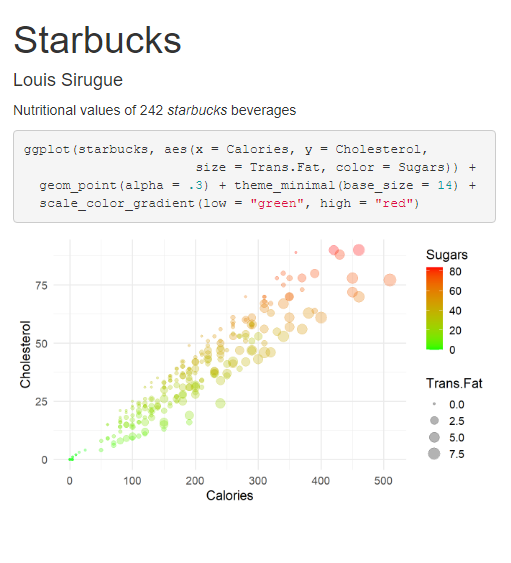
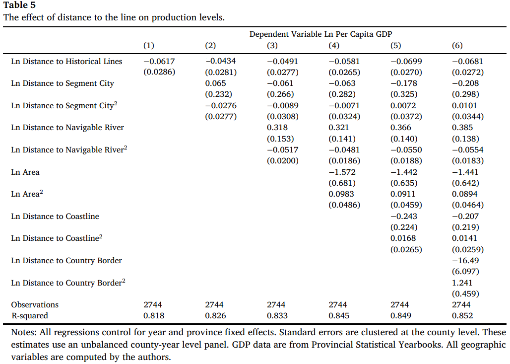
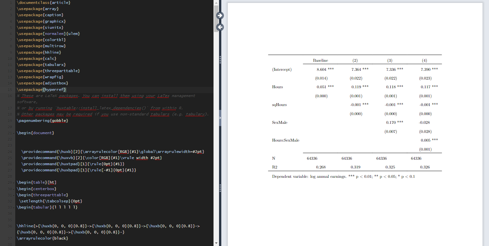
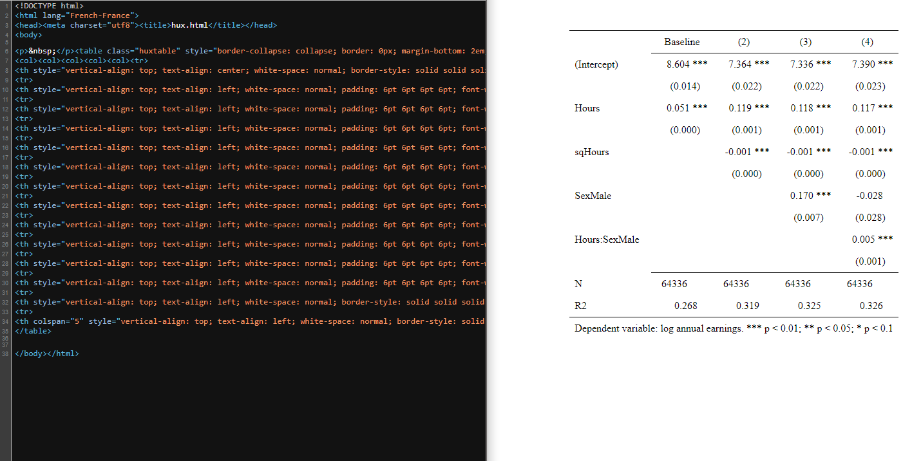
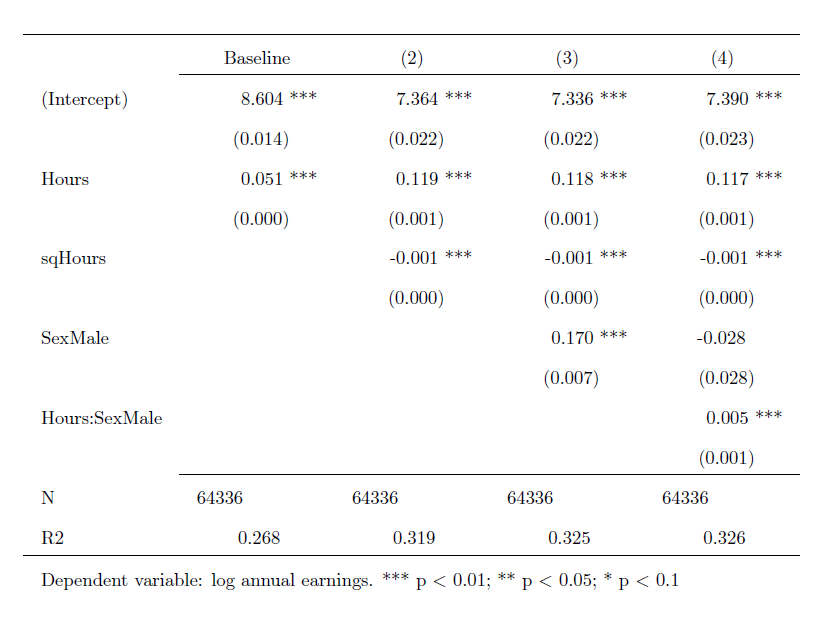
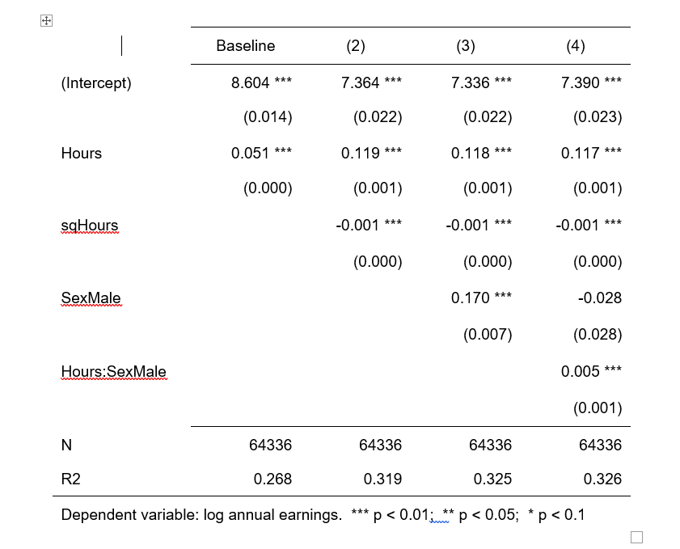

<style> .left-column {width: 65%;} .right-column {width: 31%;} </style>

```{css, echo = F, eval = F}
body{background-color:black;filter:invert(1)}
```

```{r setup, include = FALSE}
source(paste0(getwd(), "/../source/style.R"))

#devtools::install_github("gadenbuie/countdown")
library(countdown)

stargazer <- stargazer::stargazer
theme_minimal <- theme_Rcourse
theme_set(theme_gray())
options(htmltools.dir.version = F)
knitr::opts_chunk$set(echo = T, message = F, warning = F, strip.white = F, 
                      fig.align = "center", dpi = 300, out.width = "100%")
Sys.setenv(LANG = "en")

showplotly <- T
showasecplot <- T
```

### What we've seen so far

#### Manipulate data with `dplyr`

--

```{r, eval = F}
read.csv("ligue1.csv") 
                                                    #
                                                    #
                                                    #
                                                    #
                                                    #
                                                    #
```

```{r, eval = F, highlight=F}
##     Wk Day       Date  Time          Home  xG Score xG.1          Away Attendance  ...
## 1    1 Fri 2021-08-06 21:00        Monaco 2.0   1–1  0.3        Nantes       7500  ...
## 2    1 Sat 2021-08-07 17:00          Lyon 1.4   1–1  0.8         Brest      29018  ...
## 3    1 Sat 2021-08-07 21:00        Troyes 0.8   1–2  1.2     Paris S-G      15248  ...
## 4    1 Sun 2021-08-08 13:00        Rennes 0.6   1–1  2.0          Lens      22567  ...
## 5    1 Sun 2021-08-08 15:00      Bordeaux 0.7   0–2  3.3 Clermont Foot      18748  ...
## 6    1 Sun 2021-08-08 15:00    Strasbourg 0.4   0–2  0.9        Angers      23250  ...
## 7    1 Sun 2021-08-08 15:00          Nice 0.8   0–0  0.2         Reims      18030  ...
## 8    1 Sun 2021-08-08 15:00 Saint-Étienne 2.1   1–1  1.3       Lorient      20461  ...
## 9    1 Sun 2021-08-08 17:00          Metz 0.7   3–3  1.4         Lille      15551  ...
 ...  ... ...        ...   ...           ... ...   ...  ...           ...        ...  ...                      
```


---

### What we've seen so far

#### Manipulate data with `dplyr`

```{r, eval= F}
read.csv("ligue1.csv") %>%
  select(Home, xG, Score, xG.1, Away)               # Keep/drop certain columns
                                                    #
                                                    #
                                                    #
                                                    #
                                                    #
```

```{r, eval = F, highlight=F}
##              Home  xG Score xG.1          Away
## 1          Monaco 2.0   1–1  0.3        Nantes
## 2            Lyon 1.4   1–1  0.8         Brest
## 3          Troyes 0.8   1–2  1.2     Paris S-G
## 4          Rennes 0.6   1–1  2.0          Lens
## 5        Bordeaux 0.7   0–2  3.3 Clermont Foot
## 6      Strasbourg 0.4   0–2  0.9        Angers
## 7            Nice 0.8   0–0  0.2         Reims
## 8   Saint-Étienne 2.1   1–1  1.3       Lorient
## 9            Metz 0.7   3–3  1.4         Lille
 ...             ... ...   ...  ...           ...
```

---

### What we've seen so far

#### Manipulate data with `dplyr`

```{r, eval = F}
read.csv("ligue1.csv") %>%
  select(Home, xG, Score, xG.1, Away) %>%           # Keep/drop certain columns
  mutate(home_winner = xG > xG.1)                   # Create a new variable
                                                    #
                                                    #
                                                    #
                                                    #
```


```{r, eval = F, highlight=F}
##              Home  xG Score xG.1          Away home_winner
## 1          Monaco 2.0   1–1  0.3        Nantes        TRUE
## 2            Lyon 1.4   1–1  0.8         Brest        TRUE
## 3          Troyes 0.8   1–2  1.2     Paris S-G       FALSE
## 4          Rennes 0.6   1–1  2.0          Lens       FALSE
## 5        Bordeaux 0.7   0–2  3.3 Clermont Foot       FALSE
## 6      Strasbourg 0.4   0–2  0.9        Angers       FALSE
## 7            Nice 0.8   0–0  0.2         Reims        TRUE
## 8   Saint-Étienne 2.1   1–1  1.3       Lorient        TRUE
## 9            Metz 0.7   3–3  1.4         Lille       FALSE
 ...             ... ...   ...  ...           ...         ...
```

---

### What we've seen so far

#### Manipulate data with `dplyr`

```{r, eval = F}
read.csv("ligue1.csv") %>%
  select(Home, xG, Score, xG.1, Away) %>%           # Keep/drop certain columns
  mutate(home_winner = xG > xG.1) %>%               # Create a new variable
  filter(Home == "Rennes")                          # Keep/drop certain rows 
                                                    #
                                                    #
                                                    #
```

```{r, eval = F, highlight=F}
##      Home  xG Score xG.1          Away home_winner
## 1  Rennes 0.6   1–1  2.0          Lens       FALSE
## 2  Rennes 0.9   1–0  0.5        Nantes        TRUE
## 3  Rennes 1.0   0–2  0.5         Reims        TRUE
## 4  Rennes 2.4   6–0  0.3 Clermont Foot        TRUE
## 5  Rennes 0.8   2–0  1.4     Paris S-G       FALSE
## 6  Rennes 1.5   1–0  0.6    Strasbourg        TRUE
## 7  Rennes 3.8   4–1  1.1          Lyon        TRUE
## 8  Rennes 3.1   2–0  0.7   Montpellier        TRUE
## 9  Rennes 0.8   1–2  0.6         Lille        TRUE
         ... ...   ...  ...           ...         ...
```

---

### What we've seen so far

#### Manipulate data with `dplyr`

```{r, eval = F}
read.csv("ligue1.csv") %>%
  select(Home, xG, Score, xG.1, Away) %>%           # Keep/drop certain columns
  mutate(home_winner = xG > xG.1) %>%               # Create a new variable
  filter(Home == "Rennes") %>%                      # Keep/drop certain rows
  arrange(-xG)                                      # Sort rows
                                                    #
                                                    #
```

```{r, eval = F, highlight=F}
##      Home  xG Score xG.1          Away home_winner
## 1  Rennes 3.8   4–1  1.1          Lyon        TRUE
## 2  Rennes 3.3   6–0  0.4      Bordeaux        TRUE
## 3  Rennes 3.3   6–1  0.9          Metz        TRUE
## 4  Rennes 3.1   2–0  0.7   Montpellier        TRUE
## 5  Rennes 2.7   2–0  0.3         Brest        TRUE
## 6  Rennes 2.6   4–1  0.4        Troyes        TRUE
## 7  Rennes 2.4   6–0  0.3 Clermont Foot        TRUE
## 8  Rennes 1.9   2–3  2.9        Monaco       FALSE
## 9  Rennes 1.7   2–0  0.3        Angers        TRUE
         ... ...   ...  ...           ...         ...
```

---

### What we've seen so far

#### Manipulate data with `dplyr`

```{r}
read.csv("ligue1.csv") %>%
  select(Home, xG, Score, xG.1, Away) %>%           # Keep/drop certain columns
  mutate(home_winner = xG > xG.1) %>%               # Create a new variable
  filter(Home == "Rennes") %>%                      # Keep/drop certain rows
  arrange(-xG) %>%                                  # Sort rows
  summarise(expected_wins = mean(home_winner),      # Aggregate into statistics
            expected_goals = sum(xG))               #
```

---

### What we've seen so far

#### Plot data with `ggplot()`

--

```{r, eval = F, fig.width = 8, fig.height = 4.5, out.width = "60%"}
ggplot(read.csv("wid.csv"))                                         # Data
                                                                    #
```

```{r, echo = F, fig.width = 8, fig.height = 4.5, out.width = "60%"}
ggplot(read.csv("wid.csv"))                                         # Data
                                                                    #
```

---

### What we've seen so far

#### Plot data with `ggplot()`
 
```{r, eval = F, fig.width = 8, fig.height = 4.5, out.width = "60%"}
ggplot(read.csv("wid.csv"), aes(x = inc_head, y = top1))            # Data & aesthetics
                                                                    #
```
 
```{r, echo = F, fig.width = 8, fig.height = 4.5, out.width = "60%"}
ggplot(read.csv("wid.csv"), aes(x = inc_head, y = top1))            # Data & aesthetics
                                                                    #
```

---

### What we've seen so far

#### Plot data with `ggplot()`

```{r, eval = F, fig.width = 8, fig.height = 4.5, out.width=  "60%"}
ggplot(read.csv("wid.csv"), aes(x = inc_head, y = top1)) +          # Data & aesthetics
  geom_point()                                                      # Geometry
```

```{r, echo = F, fig.width = 8, fig.height = 4.5, out.width=  "60%"}
ggplot(read.csv("wid.csv"), aes(x = inc_head, y = top1)) +          # Data & aesthetics
  geom_point()                                                      # Geometry
```

---

### What we've seen so far

#### Write reports with `R markdown`

--

<p style = "margin-bottom:-.5cm;"></p>

.left-column[

````markdown
---
title: "Starbucks"    
author: "Louis Sirugue"
output: html_document
---
````
]

.right-column[
]


---

### What we've seen so far

#### Write reports with `R markdown`

<p style = "margin-bottom:-.5cm;"></p>

.left-column[

````markdown
---
title: "Starbucks"
author: "Louis Sirugue"
output: html_document
---

`r ''````{r, echo = F, message = F, warning = F}
library(ggplot2) # Load package
starbucks <- read.csv("starbucks.csv", sep = ";") # Load data
```

Nutritional values of `r "\u0060r nrow(starbucks)\u0060"` *starbucks* beverages

````
]

.right-column[
]


---

### What we've seen so far

#### Write reports with `R markdown`

<p style = "margin-bottom:-.5cm;"></p>

.left-column[

````markdown
---
title: "Starbucks"
author: "Louis Sirugue"
output: html_document
---

`r ''````{r, echo = F, message = F, warning = F}
library(ggplot2) # Load package
starbucks <- read.csv("starbucks.csv", sep = ";") # Load data
```

Nutritional values of `r "\u0060r nrow(starbucks)\u0060"` *starbucks* beverages

`r ''````{r, fig.height = 4}
ggplot(starbucks, aes(x = Calories, y = Cholesterol, 
                      size = Trans.Fat, color = Sugars)) +
  geom_point(alpha = .3) + theme_minimal(base_size = 14) +
  scale_color_gradient(low = "green", high = "red") 
```
````
]

.right-column[
]



---

<h3>Today: Econometrics in R!</h3>

<p style = "margin-bottom:2.5cm;"></p>

--

.pull-left[
<ul style = "margin-left:1.5cm;list-style: none">
  <li><b>1. Regressions</b></li>
  <ul style = "list-style: none">
    <li>1.1. On continuous variables</li>
    <li>1.2. On binary variables</li>
    <li>1.3. On categorical variables</li>
  </ul>
</ul>

<p style = "margin-bottom:1.5cm;"></p>

<ul style = "margin-left:1.5cm;list-style: none">
  <li><b>2. Case study</b></li>
  <ul style = "list-style: none">
    <li>2.1. Variable transformation</li>
    <li>2.2. Functional form</li>
    <li>2.3. Control variables</li>
    <li>2.4. Interactions</li>
  </ul>
</ul>
]

.pull-right[

<ul style = "margin-left:-1cm;list-style: none">
  <li><b>3. Inference</b></li>
  <ul style = "list-style: none">
    <li>3.1. Hypothesis testing</li>
    <li>3.2. Confidence intervals</li>
  </ul>
</ul>
 
<p style = "margin-bottom:1.5cm;"></p>

<ul style = "margin-left:-1cm;list-style: none">
  <li><b>4. Report and export results</b></li>
<ul style = "list-style: none">
    <li>4.1. Regression tables</li>
    <li>4.2. Plot coefficients</li>
    </ul>
</ul>
 
<p style = "margin-bottom:1.5cm;"></p>

<ul style = "margin-left:-1cm;list-style: none"><li><b>5. Wrap up!</b></li></ul>

]
---

<h3>Today: Econometrics in R!</h3>

<p style = "margin-bottom:2.5cm;"></p>

.pull-left[
<ul style = "margin-left:1.5cm;list-style: none">
  <li><b>1. Regressions</b></li>
  <ul style = "list-style: none">
    <li>1.1. On continuous variables</li>
    <li>1.2. On binary variables</li>
    <li>1.3. On categorical variables</li>
  </ul>
</ul>
]

---

### 1. Regressions

#### 1.1. On continuous variables

<ul>
  <li>For this part we're going to work with the <b><i>'Great Gatsby Curve'</b></i></li>
  <ul>
    <li>It refers to the positive relationship between <b>inequality</b> and <b>intergenerational income persistence</b></li>
    <li>The term was coined by Alan Krueger based on the research of Miles Corak</li>
  </ul>
</ul>

--

<p style = "margin-bottom:1.25cm;"></p>

```{r}
ggcurve <- read.csv("ggcurve.csv")
str(ggcurve)
```


<p style = "margin-bottom:1.25cm;"></p>

--

<ul>
  <li>For <b>22 countries</b> we have the following variables</li>
  <ul>
    <li><b>ige:</b> The intergenerational income elasticity, the higher the more child income is close to parent income</li>
    <li><b>gini:</b> The Gini coefficient of income inequality, the higher the more income is concentrated</li>
  </ul>
</ul>
 
---

### 1. Regressions

#### 1.1. On continuous variables

<ul>
  <li>You must already be quite familiar with univariate <b>regressions</b> \(y = \alpha + \beta x + \varepsilon\)</li>
</ul>

<p style = "margin-bottom:3.02cm;">

```{r, echo = F}
theme_set(theme_Rcourse())
```

```{r, echo = F, fig.width = 8, fig.height = 4.5, out.width=  "55%"}
b <- cov(ggcurve$gini, ggcurve$ige)/var(ggcurve$gini)
a <- mean(ggcurve$ige) - b * mean(ggcurve$gini)

mygg <- ggcurve %>%
  mutate(fit = a + b * gini)
         
ggplot(mygg, aes(x = gini)) +
  geom_point(aes(y = ige), color = "#014D64", alpha = .4) +
  geom_text(aes(y = ige + .02, label = country), color = "#014D64", alpha = .6) +
  geom_line(aes(y = fit), color = "#014D64", alpha = .8) +
  scale_x_continuous(limits = c(.3, .7)) +
  scale_y_continuous(limits = c(.1, .7))
```

---

### 1. Regressions

#### 1.1. On continuous variables

<ul>
  <li>You must already be quite familiar with univariate <b>regressions</b> \(y = \alpha + \beta x + \varepsilon\)</li>
  <ul>
    <li>We're looking for the line \(\hat{y_i} = \hat{\alpha} + \hat{\beta} x_i\) that <b>mimimizes distance</b> to the data points \(\sum\varepsilon_i^2\)</li>
  </ul>
</ul>

<p style = "margin-bottom:2.1cm;">

```{r, echo = F, fig.width = 8, fig.height = 4.5, out.width=  "55%"}
lines <- mygg %>%
  pivot_longer(c(ige, fit), values_to = 'y', names_to = 'group')
  
ggplot() +
  geom_point(data = mygg, aes(x = gini, y = ige), color = "#014D64", alpha = .4) +
  geom_line(data = mygg, aes(x = gini, y = fit), color = "#014D64", alpha = .8) +
  geom_line(data = lines, aes(x = gini, y = y, group = country), color = "#014D64", alpha = .8, linetype = "dashed") +
  scale_x_continuous(limits = c(.3, .7)) +
  scale_y_continuous(limits = c(.1, .7))
```

---

### 1. Regressions

#### 1.1. On continuous variables

<ul>
  <li>You must already be quite familiar with univariate <b>regressions</b> \(y = \alpha + \beta x + \varepsilon\)</li>
  <ul>
    <li>We're looking for the line \(\hat{y_i} = \hat{\alpha} + \hat{\beta} x_i\) that <b>mimimizes distance</b> to the data points \(\sum\varepsilon_i^2\)</li>
    <li>Such that for a <b>one unit increase</b> in \(x\)</li>
  </ul>
</ul>

<p style = "margin-bottom:1.38cm;">

```{r, echo = F, fig.width = 8, fig.height = 4.5, out.width=  "55%"}
ggplot() +
  geom_point(data = mygg, aes(x = gini, y = ige), color = "#014D64", alpha = .4) +
  geom_line(data = mygg, aes(x = gini, y = fit), color = "#014D64", alpha = .8) +
  geom_segment(aes(x = .5, xend = .5, y = .1, yend = a+.5*b), color = "#014D64", alpha = .8, linetype = "dashed") +
  geom_segment(aes(x = .6, xend = .6, y = .1, yend = a+.6*b), color = "#014D64", alpha = .8, linetype = "dashed") +
  annotate("segment", x = .51, xend = .59, y = .12, yend = .12, arrow = arrow(length = unit(.2,"cm")), color = "#014D64", alpha = .8) +
  scale_x_continuous(limits = c(.3, .7)) +
  scale_y_continuous(limits = c(.1, .7))
```

---

### 1. Regressions

#### 1.1. On continuous variables

<ul>
  <li>You must already be quite familiar with univariate <b>regressions</b> \(y = \alpha + \beta x + \varepsilon\)</li>
  <ul>
    <li>We're looking for the line \(\hat{y_i} = \hat{\alpha} + \hat{\beta} x_i\) that <b>mimimizes distance</b> to the data points \(\sum\varepsilon_i^2\)</li>
    <li>Such that for a <b>one unit increase</b> in \(x\)</li>
    <li>Its slope \(\hat{\beta}\) indicates the associated <b>expected change</b> in \(y\)</li>
  </ul>
</ul>

```{r, echo = F, fig.width = 8, fig.height = 4.5, out.width=  "55%"}
ggplot() +
  geom_point(data = mygg, aes(x = gini, y = ige), color = "#014D64", alpha = .4) +
  geom_line(data = mygg, aes(x = gini, y = fit), color = "#014D64", alpha = .8) +
  geom_segment(aes(x = .5, xend = .5, y = .1, yend = a+.5*b), color = "#014D64", alpha = .8, linetype = "dashed") +
  geom_segment(aes(x = .6, xend = .6, y = .1, yend = a+.6*b), color = "#014D64", alpha = .8, linetype = "dashed") +
  geom_segment(aes(x = .3, xend = .5, y = a+.5*b, yend = a+.5*b), color = "#014D64", alpha = .8, linetype = "dashed") +
  geom_segment(aes(x = .3, xend = .6, y = a+.6*b, yend = a+.6*b), color = "#014D64", alpha = .8, linetype = "dashed") +
  annotate("segment", x = .32, xend = .32, y = a+.5*b + .01, yend =  a+.6*b - .01, 
           arrow = arrow(length = unit(.2,"cm")), color = "#014D64", alpha = .8) +
  scale_x_continuous(limits = c(.3, .7)) +
  scale_y_continuous(limits = c(.1, .7))
```

---

### 1. Regressions

#### 1.1. On continuous variables

<ul>
  <li>In R we can <b>estimate a regression</b> model using the <b>lm()</b> command <i>(for <b>L</b>inear <b>M</b>odel)</i></li>
  <ol>
    <li></li>
    <li></li>
  </ol>
</ul>

```{r, eval = F}
lm( , )
```

---

### 1. Regressions

#### 1.1. On continuous variables

<ul>
  <li>In R we can <b>estimate a regression</b> model using the <b>lm()</b> command <i>(for <b>L</b>inear <b>M</b>odel)</i></li>
  <ol>
    <li>The first argument is the <b>formula</b>, written as <b>y ~ x</b></li>
    <li></li>
  </ol>
</ul>

```{r, eval = F}
lm(ige ~ gini, )
```

---

### 1. Regressions

#### 1.1. On continuous variables

<ul>
  <li>In R we can <b>estimate a regression</b> model using the <b>lm()</b> command <i>(for <b>L</b>inear <b>M</b>odel)</i></li>
  <ol>
    <li>The first argument is the <b>formula</b>, written as <b>y ~ x</b></li>
    <li>The second argument is the <b>data</b> containing the variables</li>
  </ol>
</ul>

```{r, eval = F}
lm(ige ~ gini, ggcurve)
```

--

```{r, echo = F}
lm(ige ~ gini, ggcurve)
```

--

<ul>
  <li>This is great but the <b>output</b> is a bit minimalistic</b></li>
  <ul>
    <li>To get a more <b>exhaustive description</b> of our regression we can apply the <b>summary()</b> function to lm()</li>
  </ul>
</ul>

--

```{r}
ggmodel <- lm(ige ~ gini, ggcurve) %>% summary()
```

---

### 1. Regressions

#### 1.1. On continuous variables

<p style = "margin-bottom:-.35cm;"></p>

```{r}
ggmodel
```

---

### 1. Regressions

#### 1.1. On continuous variables

 * It gives back the **command** 
 
.left-column[

<p style = "margin-bottom:-.53cm;"></p>
 
```{r, eval = F, highlight = F}
## 
## Call:
## lm(formula = ige ~ gini, data = ggcurve)
## 
## 
## 
## 
## 
## 
## 
## 
## 
## 
## 
## 
## 
## 
## 
```
]

.right-column[
<b>&#x1F804;</b> Command
]

---

### 1. Regressions

#### 1.1. On continuous variables

 * A description of the **distribution** of **residuals**
 
.left-column[

<p style = "margin-bottom:-.53cm;"></p>

```{r, eval = F, highlight = F}
## 
## Call:
## lm(formula = ige ~ gini, data = ggcurve)
## 
## Residuals:
##       Min        1Q    Median        3Q       Max 
## -0.188991 -0.088238 -0.000855  0.047284  0.252310 
## 
## 
##
## 
##
## 
## 
## 
## 
## 
## 
```
]

.right-column[
<b>&#x1F804;</b> Command  
<p style = "margin-bottom:1.5cm;"></p>
<b>&#x1F804;</b> Residuals distribution
]

---

### 1. Regressions

#### 1.1. On continuous variables

 * **Coefficients** along with their **standard error**, **t-value**, and **p-value**
 
.left-column[

<p style = "margin-bottom:-.53cm;"></p>
 
```{r, eval = F, highlight = F}
## 
## Call:
## lm(formula = ige ~ gini, data = ggcurve)
## 
## Residuals:
##       Min        1Q    Median        3Q       Max 
## -0.188991 -0.088238 -0.000855  0.047284  0.252310 
## 
## Coefficients:
##             Estimate Std. Error t value Pr(>|t|)   
## (Intercept) -0.09129    0.12870  -0.709  0.48631   
## gini         1.01546    0.26425   3.843  0.00102 
## 
## 
## 
## 
## 
## 
```
]

.right-column[
<b>&#x1F804;</b> Command  
<p style = "margin-bottom:1.5cm;"></p>
<b>&#x1F804;</b> Residuals distribution  
<p style = "margin-bottom:1.75cm;"></p>
<b>&#x1F804;</b> Coefs, s.e., t-/p-values
]

---

### 1. Regressions

#### 1.1. On continuous variables

 * **Significance** thresholds with symbols
 
.left-column[

<p style = "margin-bottom:-.53cm;"></p>
  
```{r, eval = F, highlight = F}
## 
## Call:
## lm(formula = ige ~ gini, data = ggcurve)
## 
## Residuals:
##       Min        1Q    Median        3Q       Max 
## -0.188991 -0.088238 -0.000855  0.047284  0.252310 
## 
## Coefficients:
##             Estimate Std. Error t value Pr(>|t|)   
## (Intercept) -0.09129    0.12870  -0.709  0.48631   
## gini         1.01546    0.26425   3.843  0.00102 **
## ---
## Signif. codes:  0 '***' 0.001 '**' 0.01 '*' 0.05 '.' 0.1 ' ' 1
## 
## 
## 
## 
```
]

.right-column[
<b>&#x1F804;</b> Command  
<p style = "margin-bottom:1.5cm;"></p>
<b>&#x1F804;</b> Residuals distribution  
<p style = "margin-bottom:1.75cm;"></p>
<b>&#x1F804;</b> Coefs, s.e., t-/p-values  
<p style = "margin-bottom:1.25cm;"></p>
<b>&#x1F804;</b> Significance  
]

---

### 1. Regressions

#### 1.1. On continuous variables

<p style = "margin-bottom:-.07cm;"></p>

 * The **residual standard error** $\sqrt{\sum{(y_i-\hat{y_i})^2}/\text{df}}$ and **degrees of freedom**
 
<p style = "margin-bottom:-.07cm;"></p>

.left-column[

<p style = "margin-bottom:-.53cm;"></p>
  
```{r, eval = F, highlight = F}
## 
## Call:
## lm(formula = ige ~ gini, data = ggcurve)
## 
## Residuals:
##       Min        1Q    Median        3Q       Max 
## -0.188991 -0.088238 -0.000855  0.047284  0.252310 
## 
## Coefficients:
##             Estimate Std. Error t value Pr(>|t|)   
## (Intercept) -0.09129    0.12870  -0.709  0.48631   
## gini         1.01546    0.26425   3.843  0.00102 **
## ---
## Signif. codes:  0 '***' 0.001 '**' 0.01 '*' 0.05 '.' 0.1 ' ' 1
## 
## Residual standard error: 0.1159 on 20 degrees of freedom
## 
## 
```
]

.right-column[
<p style = "margin-bottom:-.02cm;"></p>
<b>&#x1F804;</b> Command  
<p style = "margin-bottom:1.5cm;"></p>
<b>&#x1F804;</b> Residuals distribution  
<p style = "margin-bottom:1.75cm;"></p>
<b>&#x1F804;</b> Coefs, s.e., t-/p-values  
<p style = "margin-bottom:1.25cm;"></p>
<b>&#x1F804;</b> Significance  
<p style = "margin-bottom:-.2cm;"></p>
<b>&#x1F804;</b> Residual s.e. & df.  
]

---

### 1. Regressions

#### 1.1. On continuous variables

 * The $R^2$ and **adjusted** $R^2$
 
.left-column[

<p style = "margin-bottom:-.53cm;"></p>
  
```{r, eval = F, highlight = F}
## 
## Call:
## lm(formula = ige ~ gini, data = ggcurve)
## 
## Residuals:
##       Min        1Q    Median        3Q       Max 
## -0.188991 -0.088238 -0.000855  0.047284  0.252310 
## 
## Coefficients:
##             Estimate Std. Error t value Pr(>|t|)   
## (Intercept) -0.09129    0.12870  -0.709  0.48631   
## gini         1.01546    0.26425   3.843  0.00102 **
## ---
## Signif. codes:  0 '***' 0.001 '**' 0.01 '*' 0.05 '.' 0.1 ' ' 1
## 
## Residual standard error: 0.1159 on 20 degrees of freedom
## Multiple R-squared:  0.4247,    Adjusted R-squared:  0.396 
## 
```
]

.right-column[
<b>&#x1F804;</b> Command  
<p style = "margin-bottom:1.5cm;"></p>
<b>&#x1F804;</b> Residuals distribution  
<p style = "margin-bottom:1.75cm;"></p>
<b>&#x1F804;</b> Coefs, s.e., t-/p-values  
<p style = "margin-bottom:1.25cm;"></p>
<b>&#x1F804;</b> Significance  
<p style = "margin-bottom:-.2cm;"></p>
<b>&#x1F804;</b> Residual s.e. & df.  
<b>&#x1F804;</b> R<sup>2</sup> & adjusted R<sup>2</sup>  
]

---

### 1. Regressions

#### 1.1. On continuous variables

<ul><li>The result of an <b>F-test</b> (\(H_0: \beta_k = 0 \:\: \forall k\))</li></ul>
 
.left-column[

<p style = "margin-bottom:-.53cm;"></p>
  
```{r, eval = F, highlight = F}
## 
## Call:
## lm(formula = ige ~ gini, data = ggcurve)
## 
## Residuals:
##       Min        1Q    Median        3Q       Max 
## -0.188991 -0.088238 -0.000855  0.047284  0.252310 
## 
## Coefficients:
##             Estimate Std. Error t value Pr(>|t|)   
## (Intercept) -0.09129    0.12870  -0.709  0.48631   
## gini         1.01546    0.26425   3.843  0.00102 **
## ---
## Signif. codes:  0 '***' 0.001 '**' 0.01 '*' 0.05 '.' 0.1 ' ' 1
## 
## Residual standard error: 0.1159 on 20 degrees of freedom
## Multiple R-squared:  0.4247,    Adjusted R-squared:  0.396 
## F-statistic: 14.77 on 1 and 20 DF,  p-value: 0.001016
```
]

.right-column[
<b>&#x1F804;</b> Command  
<p style = "margin-bottom:1.5cm;"></p>
<b>&#x1F804;</b> Residuals distribution  
<p style = "margin-bottom:1.75cm;"></p>
<b>&#x1F804;</b> Coefs, s.e., t-/p-values  
<p style = "margin-bottom:1.25cm;"></p>
<b>&#x1F804;</b> Significance  
<p style = "margin-bottom:-.2cm;"></p>
<b>&#x1F804;</b> Residual s.e. & df.  
<b>&#x1F804;</b> R<sup>2</sup> & adjusted R<sup>2</sup>  
<b>&#x1F804;</b> F-test results
]

---

### 1. Regressions

#### 1.1. On continuous variables

 * All these elements are then easily accessible with the `$` operator 

```{r}
str(ggmodel, give.attr = F)
```

--

<p style = "margin-bottom:1cm;"></p>

<center><b><i>&#10140; Let's try it out!</i></b></center>

---

### 1. Regressions

#### 1.1. On continuous variables

 * Take the **coefficients** for instance

```{r}
ggmodel$coefficients
```

--

 * We can **subset** this matrix like we would do with a regular `data.frame`
 
```{r}
ggmodel$coefficients[2, 1]
```

--

```{r}
ggmodel$coefficients[, "Pr(>|t|)"]
```

---

### 1. Regressions

#### 1.1. On continuous variables

 * We can also easily **plot** the **distribution** of our **residuals** 
 
```{r, eval = F}
ggplot(tibble(x = ggmodel$residuals), aes(x = x)) +
  geom_density() + geom_vline(xintercept = 0, linetype = "dashed")
```

--
 
```{r, echo = F, fig.width = 8, fig.height = 4.25, out.width = "60%"}
ggplot(tibble(x = ggmodel$residuals), aes(x = x)) +
  geom_density(fill = "#6794A7", color = "#014D64", alpha = .6) + 
  geom_vline(xintercept = 0, linetype = "dashed", color = "#014D64") +
  theme(axis.title.x = element_blank())
```

---

### 1. Regressions

#### 1.1. On continuous variables

 * Note that ggplot() has a dedicated **geometry for fitted values:** `geom_smooth()`

--

```{r, eval = F}
ggplot(ggcurve, aes(x = gini, y = ige)) + 
  geom_point() + geom_smooth(method = "lm")
```

--

```{r, echo = F, fig.width = 8, fig.height = 4.25, out.width = "60%"}
ggplot(ggcurve, aes(x = gini, y = ige)) + 
  geom_point() + 
  geom_smooth(method = "lm") +
  theme(axis.title.x = element_blank())
```

---

### Practice 

<center><i><b>Check that lm() works fine by computing the \(R^2\) manually</b></i></center>

<p style = "margin-bottom:1.25cm;"></p>

--

#### 1) Start by creating a variable for $\hat{\beta}$, then for $\hat{\alpha}$, $\hat{y_i}$, and $\hat{\varepsilon_i}$.

--

$$\hat{\beta} = \frac{\text{Cov}(x, y)}{\text{Var}(x)} \:\:\:\: \:\:\:\:\: ; \:\:\:\:\:\:\:\:\: \hat{\alpha} = \bar{y} - \hat{\beta} \times\bar{x}$$

*You're gonna need the `cov()` and `var()` functions*

<p style = "margin-bottom:1.25cm;"></p>

--

#### 2) Summarise the data into only $\hat{\alpha}$, $\hat{\beta}$, and the $R^2$

--

$$R^2 = 1 - \frac{\sum(y_i-\hat{y_i})^2}{\sum(y_i-\bar{y_i})^2}$$

<p style = "margin-bottom:1.25cm;"></p>

--

<center><h3><i>You've got 10 minutes!</i></h3></center>

`r countdown(minutes = 10, top = 0, right = 0)`

---

### Solution

```{r, eval = F}
ggcurve %>% 
    mutate(beta = cov(gini, ige) / var(gini)) 
#
#
#
#
#
#
```

```{r, eval = F, highlight = F}
##           country  ige      gini     beta 
## 1         Denmark 0.15 0.3781796 1.015462 
## 2          Norway 0.17 0.3250102 1.015462 
## 3         Finland 0.18 0.3779868 1.015462 
## 4          Canada 0.19 0.4631237 1.015462 
## 5       Australia 0.26 0.4385511 1.015462 
## 6          Sweden 0.27 0.3582480 1.015462 
## 7     New Zealand 0.29 0.5039373 1.015462 
## 8         Germany 0.32 0.4377010 1.015462 
## 9           Japan 0.34 0.5198383 1.015462 
## 10          Spain 0.40 0.4826243 1.015462 
## 11         France 0.41 0.4495654 1.015462 
## ..            ...  ...       ...      ... 
```

---

### Solution

```{r, eval = F}
ggcurve %>% 
    mutate(beta = cov(gini, ige) / var(gini),
           alpha = mean(ige) - beta * mean(gini))
#
#
#
#
#
```

```{r, eval = F, highlight = F}
##           country  ige      gini     beta       alpha 
## 1         Denmark 0.15 0.3781796 1.015462 -0.09129311 
## 2          Norway 0.17 0.3250102 1.015462 -0.09129311 
## 3         Finland 0.18 0.3779868 1.015462 -0.09129311 
## 4          Canada 0.19 0.4631237 1.015462 -0.09129311 
## 5       Australia 0.26 0.4385511 1.015462 -0.09129311 
## 6          Sweden 0.27 0.3582480 1.015462 -0.09129311 
## 7     New Zealand 0.29 0.5039373 1.015462 -0.09129311 
## 8         Germany 0.32 0.4377010 1.015462 -0.09129311 
## 9           Japan 0.34 0.5198383 1.015462 -0.09129311 
## 10          Spain 0.40 0.4826243 1.015462 -0.09129311 
## 11         France 0.41 0.4495654 1.015462 -0.09129311 
## ..            ...  ...       ...      ...         ... 
```

---

### Solution

```{r, eval = F}
ggcurve %>% 
    mutate(beta = cov(gini, ige) / var(gini),
           alpha = mean(ige) - beta * mean(gini),
           fit = alpha + beta * gini)  
#
#
#
#
```

```{r, eval = F, highlight = F}
##           country  ige      gini     beta       alpha       fit 
## 1         Denmark 0.15 0.3781796 1.015462 -0.09129311 0.2927339 
## 2          Norway 0.17 0.3250102 1.015462 -0.09129311 0.2387424 
## 3         Finland 0.18 0.3779868 1.015462 -0.09129311 0.2925381 
## 4          Canada 0.19 0.4631237 1.015462 -0.09129311 0.3789915 
## 5       Australia 0.26 0.4385511 1.015462 -0.09129311 0.3540389 
## 6          Sweden 0.27 0.3582480 1.015462 -0.09129311 0.2724942 
## 7     New Zealand 0.29 0.5039373 1.015462 -0.09129311 0.4204361 
## 8         Germany 0.32 0.4377010 1.015462 -0.09129311 0.3531757 
## 9           Japan 0.34 0.5198383 1.015462 -0.09129311 0.4365829 
## 10          Spain 0.40 0.4826243 1.015462 -0.09129311 0.3987935
## 11         France 0.41 0.4495654 1.015462 -0.09129311 0.3652234
## ..            ...  ...       ...      ...         ...       ...
```

---

### Solution

```{r, eval = F}
ggcurve %>% 
    mutate(beta = cov(gini, ige) / var(gini),
           alpha = mean(ige) - beta * mean(gini),
           fit = alpha + beta * gini,
           residuals = ige - fit)
#
#
#
```

```{r, eval = F, highlight = F}
##           country  ige      gini     beta       alpha       fit     residuals
## 1         Denmark 0.15 0.3781796 1.015462 -0.09129311 0.2927339 -0.1427339244
## 2          Norway 0.17 0.3250102 1.015462 -0.09129311 0.2387424 -0.0687424324
## 3         Finland 0.18 0.3779868 1.015462 -0.09129311 0.2925381 -0.1125381050
## 4          Canada 0.19 0.4631237 1.015462 -0.09129311 0.3789915 -0.1889914561
## 5       Australia 0.26 0.4385511 1.015462 -0.09129311 0.3540389 -0.0940388831
## 6          Sweden 0.27 0.3582480 1.015462 -0.09129311 0.2724942 -0.0024941569
## 7     New Zealand 0.29 0.5039373 1.015462 -0.09129311 0.4204361 -0.1304360777
## 8         Germany 0.32 0.4377010 1.015462 -0.09129311 0.3531757 -0.0331756674
## 9           Japan 0.34 0.5198383 1.015462 -0.09129311 0.4365829 -0.0965829037
## 10          Spain 0.40 0.4826243 1.015462 -0.09129311 0.3987935  0.0012065012
## 11         France 0.41 0.4495654 1.015462 -0.09129311 0.3652234  0.0447765627
## ..            ...  ...       ...      ...         ...       ...           ...
```

---

### Solution

```{r, eval = F}
ggcurve %>% 
    mutate(beta = cov(gini, ige) / var(gini),
           alpha = mean(ige) - beta * mean(gini),
           fit = alpha + beta * gini,
           residuals = ige - fit) %>%
    summarise(alpha = alpha[1],
              beta = beta[1],
              r2 = 1 - sum(residuals^2)/sum((ige - mean(ige))^2))
```

```{r, eval = F, highlight = F}
##         alpha     beta       r2
## 1 -0.09129311 1.015462 0.424749
```

--

```{r}
ggmodel$coefficients[, "Estimate"]
```

--

```{r}
ggmodel$r.squared
```

---

### 1. Regressions

#### 1.2. On binary variables

 * Now consider that we want to know the **relationship** between **not** being a **European country** and the **ige**

--

```{r, output.width = 120}
ggcurve$country
```

--
<p style = "margin-bottom:1cm;"></p>

```{r}
europe <- c("Denmark", "Norway", "Finland", "Sweden", "Germany", "Spain", 
            "France", "Switzerland", "Italy", "United Kingdom")
```

--
<p style = "margin-bottom:1cm;"></p>

```{r}
ggcurve <- ggcurve %>%
  mutate(continent = ifelse(country %in% europe, "Europe", "Other"))
```

---

### 1. Regressions

#### 1.2. On binary variables

 * Can we just **regress** ige **on** continent even though it's a **character** variable?
 
<p style = "margin-bottom:1cm;"></p>

```{r, eval = F}
lm(ige ~ continent, ggcurve)
```

--

```{r, echo = F}
lm(ige ~ continent, ggcurve)
```

<p style = "margin-bottom:1.5cm;"></p>

 * Seems like we can!
 
--
 
<p style = "margin-bottom:1cm;"></p>
 
<center><b><i>&#10140; But what's actually going on?</i></b></center>

---

### 1. Regressions

#### 1.2. On binary variables

 * R implicitely **converts** character variables into **binary** variables

```{r, echo = F, fig.width = 4.5, fig.height = 4.5, out.width = "40%"}
ggplot(ggcurve, aes(x = continent, y = ige)) +
  geom_violin(fill = "#6794A7", color = "#014D64", alpha = .4, width = .5) + 
  geom_point(color = "#014D64", alpha = .8)
```


---

### 1. Regressions

#### 1.2. On binary variables

 * Such that just **like** in the **continuous** case...

```{r, echo = F, fig.width = 4.5, fig.height = 4.5, out.width = "40%"}
ggplot(ggcurve, aes(x = continent, y = ige)) +
  geom_violin(fill = "#6794A7", color = "#014D64", alpha = .4, width = .5) + 
  geom_point(color = "#014D64", alpha = .8) +
  scale_x_discrete(labels = 0:1)
```

---

### 1. Regressions

#### 1.2. On binary variables

 * ... we're looking at a **1-unit increase** in $x$ *(i.e., swiching from 0 (Europe) to 1 (Other))*

```{r, echo = F, fig.width = 4.5, fig.height = 4.5, out.width = "40%"}
ggplot(ggcurve, aes(x = continent, y = ige)) +
  geom_violin(fill = "#6794A7", color = "#014D64", alpha = .4, width = .5) + 
  geom_point(color = "#014D64", alpha = .8) +
  annotate("segment", x = 1.25, xend = 1.75, y = .17, yend = .17, arrow = arrow(length = unit(.2,"cm")), color = "#014D64", alpha = .8) +
  scale_x_discrete(labels = 0:1)
```

---

### 1. Regressions

#### 1.2. On binary variables

 * As you know the **fit** is necessarily going through the **mean of each category**
 
```{r, echo = F, fig.width = 4.5, fig.height = 4.5, out.width = "40%"}
meu <- mean(ggcurve$ige[ggcurve$continent == "Europe"])
mot <- mean(ggcurve$ige[ggcurve$continent == "Other"])

ggplot(ggcurve, aes(x = continent, y = ige)) +
  geom_violin(fill = "#6794A7", color = "#014D64", alpha = .4, width = .5) + 
  geom_point(color = "#014D64", alpha = .8) +
  geom_point(data = tibble(continent = c("Europe", "Other"), ige = c(meu, mot)), size = 5, shape = 4, color = "#014D64", alpha = .8) +
  geom_segment(aes(x = 1, xend = 2, y = meu, yend = mot), color = "#014D64", alpha = .8, linetype = "dashed") +
  scale_x_discrete(labels = 0:1)
```

---

### 1. Regressions

#### 1.2. On binary variables

 * Such that $\hat{\alpha}$ is the **mean of the reference group** 
 
```{r, echo = F, fig.width = 4.5, fig.height = 4.5, out.width = "40%"}
ggplot(ggcurve, aes(x = continent, y = ige)) +
  geom_violin(fill = "#6794A7", color = "#014D64", alpha = .4, width = .5) + 
  geom_point(color = "#014D64", alpha = .8) +
  geom_point(data = tibble(continent = c("Europe", "Other"), ige = c(meu, mot)), size = 5, shape = 4, color = "#014D64", alpha = .8) +
  geom_segment(aes(x = 1, xend = 2, y = meu, yend = mot), color = "#014D64", alpha = .8, linetype = "dashed") +
  geom_text(data = tibble(x = .9, y = meu, text = "α"), aes(x = x, y = y, label = text), color = "#014D64", alpha = .8) +
  scale_x_discrete(labels = 0:1)
```

---

### 1. Regressions

#### 1.2. On binary variables

<p style = "margin-bottom:-.1cm;"></p>

 * And $\hat{\beta}$ is the **difference in means**
 
<p style = "margin-bottom:-.025cm;"></p>
 
```{r, echo = F, fig.width = 4.5, fig.height = 4.5, out.width = "40%"}
ggplot(ggcurve, aes(x = continent, y = ige)) +
  geom_violin(fill = "#6794A7", color = "#014D64", alpha = .4, width = .5) + 
  geom_point(color = "#014D64", alpha = .8) +
  geom_point(data = tibble(continent = c("Europe", "Other"), ige = c(meu, mot)), size = 5, shape = 4, color = "#014D64", alpha = .8) +
  geom_segment(aes(x = 1, xend = 2, y = meu, yend = mot), color = "#014D64", alpha = .8, linetype = "dashed") +
  geom_segment(aes(x = 1, xend = 2, y = meu, yend = meu), color = "#014D64", alpha = .8, linetype = "dotted") +
  geom_segment(aes(x = 2, xend = 2, y = meu, yend = mot), color = "#014D64", alpha = .8, linetype = "dotted") +
  geom_text(data = tibble(x = .9, y = meu, text = "α"), aes(x = x, y = y, label = text), color = "#014D64", alpha = .8) +
  geom_text(data = tibble(x = 2.1, y = (meu + mot)/2, text = "β"), aes(x = x, y = y, label = text), color = "#014D64", alpha = .8) +
  scale_x_discrete(labels = 0:1)
```

---

### 1. Regressions

#### 1.2. On binary variables

 * We can verify that easily:

<p style = "margin-bottom:1cm;"></p>

--
 
.pull-left[
```{r}
ggcurve %>% 
  group_by(continent) %>%
  summarise(ybar = mean(ige)) %>%
  mutate(relative = ybar - ybar[1])
```
]

--

.pull-right[
```{r}
lm(ige ~ continent, ggcurve)
```
]

--

<p style = "margin-bottom:1.5cm;"></p>

<center><b>&#10140; And what about discrete variables with more than 2 categories?</b></center>

---

### 1. Regressions

#### 1.3. On categorical variables

<ul>
  <li>Let's work on the <a href = "https://www.census.gov/data/datasets/time-series/demo/cps/cps-asec.html">2020 Annual Social and Economic (ASEC) Supplement</a> to the US CPS</li>
  <ul>
  <li>Here is an extract on 64,336 working individuals with positive earnings</li>
  <li>For which I kept only 4 variables:</li>
  </ul>
</ul>

--

```{r}
asec <- read.csv("asec.csv")
str(asec)
```

--

 * Let's say we want to regress earnings on Race

```{r}
unique(asec$Race)
```

---

### 1. Regressions

#### 1.3. On categorical variables

<ul>
  <li>Just like the <b>2-category</b> variable was equivalent to <b>1 dummy</b> variable</li>
  <ul>
    <li>An <b>n-category</b> variable is equivalent to <b>n-1 dummy</b> variables</li>
  </ul>
</ul>

--

<p style = "margin-bottom:1.25cm;"></p>

.pull-left[

```{r, echo = F}
dummy_conversion <- tibble(Continent = rep(c("Europe", "Other"), each = 3),
       Other = rep(c(0, 1), each = 3),
       ` ` = rep("    ", 6), 
       Race = rep(c("Black", "Other", "White"), each = 2), 
       `Other ` = c(0, 0, 1, 1, 0, 0),
       White = c(0, 0, 0, 0, 1, 1))

kable(dummy_conversion, caption = " ") %>%
  column_spec(3, width = "3em")
```
]

--

.pull-right[
```{r}
lm(Earnings ~ Race, asec)
```

]

<p style = "margin-bottom:1.5cm;"></p>

 * Instead of 1 $x$ axis we're going to have n-1 $x$ axes

---

### 1. Regressions

#### 1.3. On categorical variables

<p style = "margin-bottom:1.5cm;"></p>

.pull-left[
<center><b>2-category variable</b></center>

<p style = "margin-bottom:2cm;"></p>

```{r, echo = F, fig.width = 6, fig.height = 4, out.width = "90%"}
asec <- asec %>%
  mutate(White = as.numeric(Race == "White"),
         Other = as.numeric(Race == "Other"),
         `Log Earnings` = log(Earnings))
         
ggplot(ggcurve, aes(x = continent, y = ige)) +
  geom_violin(fill = "#6794A7", color = "#014D64", alpha = .4, width = .5) + 
  geom_segment(aes(x = 1, xend = 2, y = meu, yend = mot), color = "#014D64", alpha = .8, linetype = "dashed") +
  geom_point(color = "#014D64", alpha = .8)
```

]

.pull-right[
<!-- -->
<center><b>3-category variable</b></center>
```{r, echo = F, fig.width = 6, fig.height = 1.25, out.width= '100%', eval = showplotly}
library(reshape2)
library(plotly)

asec_plotly <- asec %>% filter(row_number() %in% sample(1:nrow(asec), round(nrow(asec)/25), replace = F)) 

petal_lm <- lm(`Log Earnings` ~ White + Other, asec_plotly)
graph_reso <- 0.05

#Setup Axis
axis_x <- seq(min(asec_plotly$White), max(asec_plotly$White), by = graph_reso)
axis_y <- seq(min(asec_plotly$Other), max(asec_plotly$Other), by = graph_reso)

#Sample points
petal_lm_surface <- expand.grid(White = axis_x, Other = axis_y, KEEP.OUT.ATTRS = F)
petal_lm_surface$`Log Earnings` <- predict.lm(petal_lm, newdata = petal_lm_surface)
petal_lm_surface <- acast(petal_lm_surface, Other ~ White, value.var = "Log Earnings") #y ~ x

plot_ly(asec_plotly, x = ~White, y = ~Other, z = ~`Log Earnings`) %>% 
  add_markers(opacity = .005) %>%
  add_trace(z = petal_lm_surface,
            x = axis_x,
            y = axis_y,
            type = "surface", 
            colorscale ='YlGnBu',
            opacity = .8) %>% 
  layout(plot_bgcolor = "#DFE6EB", paper_bgcolor = "#DFE6EB", fig_bgcolor = "#DFE6EB",
         aspectratio = list(x = 2, y = 1, z = .5),
         scene = list(xaxis = list(title = 'White'),
                      yaxis = list(title = 'Other'),
                      zaxis = list(title = 'Log Earnings'),
                      camera = list(eye = list(x = -.75, 
                                               y = -2, 
                                               z = .75)))) %>% 
  style(hoverinfo = 'skip')
```
<!-- -->
]

---

### 1. Regressions

#### 1.3. On categorical variables

 * Once again the **constant** is the **average** $y$ and the **slopes** are the relative **differences in means**

.pull-left[
```{r}
lm(Earnings ~ Race, asec)
```
]

--

.pull-right[
```{r}
asec %>%
  group_by(Race) %>%
  summarise(ybar = mean(Earnings)) %>%
  mutate(relative = ybar - ybar[1])
```

]

--

<p style = "margin-bottom:1cm;"></p>

<ul>
  <li>Note that R always sorts <b>character</b> variables by <b>alphabetical order</b></li>
  <ul>
    <li>But it would be more natural to interpret relative to the <b>majority group</b></li>
    <li>Then how to change the <b>reference category</b> in the regression?</li>
  </ul>
</ul>

---

### 1. Regressions

#### 1.3. On categorical variables

<ul>
  <li>The function to set the reference category is <b>relevel()</b></li>
  <ul>
    <li>The first argument is the <b>vector</b> to indicate the reference of</li>
    <li>The second argument is the value of the <b>reference group</b></li>
  </ul>
</ul>


<p style = "margin-bottom:1.25cm;"></p>

--

```{r, eval = F}
lm(Earnings ~ relevel(Race, "White"), asec)
```

--

```{r, echo = F, error = T}
lm(Earnings ~ relevel(Race, "White"), asec)
```


<p style = "margin-bottom:1.25cm;"></p>

 * Oops! I need to introduce you a <b>new class</b> of R objects first: `factors`

--

.pull-left[
```{r}
as.factor(asec$Race) %>% 
  levels()
```
]

--

.pull-right[
```{r}
as.factor(asec$Race) %>% 
  relevel("White") %>% 
  levels()
```
]

---

### 1. Regressions

#### 1.3. On categorical variables

<ul>
  <li>The <b>factor class</b> is made for variables whose values <b>indicate</b> different <b>groups</b></li>
  <ul>
    <li>Values are just <b>arbitrary group classifiers</b></li>
  </ul>
</ul>

--

```{r}
individuals <- as.factor(c(1, 2, 3, 4, 5))
individuals[1]
```

--

<p style = "margin-bottom:1cm;"></p>

<ul>
  <li>With <b>factors</b>, R understands that the different values <b>do not mean anything</b></li>
  <ul>
    <li>And applying <b>standard operations</b> to factors <b>does not make sense</b></li>
  </ul>
</ul>

--

```{r, warning = T}
individuals * 2
```

---

### Practice
<p style = "margin-bottom:1.5cm;"></p>

#### 1) Open the data from the World Inequality Database we used in lecture 2
<p style = "margin-bottom:1.55cm;"></p>

--

#### 2) Regress the income share of the top 1% on the year variable
<p style = "margin-bottom:1.5cm;"></p>

--

#### 3) Redo the same regression after having converted the year variable as a `factor`

<p style = "margin-bottom:3.5cm;"></p>

--

<center><h3><i>You've got 5 minutes!</i></h3></center>

`r countdown(minutes = 5, top = 0, right = 0)`

---

### Solution
<p style = "margin-bottom:1.5cm;"></p>

#### 1) Open the data from the World Inequality Database we used in lecture 2

--

```{r}
wid <- read.csv("wid.csv")
```

<p style = "margin-bottom:2cm;"></p>

#### 2) Regress the income share of the top 1% on the year variable

--

```{r}
lm(top1 ~ year, wid)
```

---

### Solution
<p style = "margin-bottom:1.5cm;"></p>

#### 3) Redo the same regression after having converted the year variable as a `factor`

--

```{r}
lm(top1 ~ year, wid %>% mutate(year = as.factor(year)))
```

---

### 1. Regressions

#### 1.3. On categorical variables

<ul>
  <li>Another option to include categorical variables is to <b><i>one hot encode</i></b> the data</li>
  <ul>
    <li>It simply mean <b>converting</b> the discrete variables into dummies such that <b>everything</b> is <b>numeric</b></li>
  </ul>
</ul>

--

```{r}
asec <- asec %>% mutate(White = as.numeric(Race == "White"),
                        Black = as.numeric(Race == "Black"),
                        Other = as.numeric(Race == "Other"))
```

--

 * Then we can use the `+` symbol to include n-1 categories in the regression

```{r, eval = F}
lm(Earnings ~ Black + Other, asec)
```

--

```{r, echo = F}
lm(Earnings ~ Black + Other, asec)
```
---

### 1. Regressions

#### 1.3. On categorical variables

<ul>
  <li>But do we really need to <b>omit</b> one <b>category?</b></li>
  <ul>
    <li>As we are in the multivariate case let's move from \(\hat{\beta} = \frac{\text{Cov}(x, y)}{\text{Var}(x)}\)</li>
    <li>To \(\hat{\beta} = (X'X)^{-1}X'y\)</li>
  </ul>
</ul>

<p style="margin-bottom:1.5cm"></p>

--

```{r}
y <- as.matrix(asec$Earnings)

X <- asec %>% 
  mutate(constant = 1) %>% 
  select(constant, White, Black, Other) %>% 
  as.matrix()
```

<p style="margin-bottom:.75cm"></p>

--

.left-column[
.pull-left[
```{r}
dim(X)
```

]
.pull-right[
```{r}
dim(t(X))
```
]
]
.right-column[
<p style="margin-bottom:-.53cm"></p>
```{r}
dim(t(X) %*% X)
```
]

---

### 1. Regressions

#### 1.3. On categorical variables

 * Because of perfect <b>multicollinearity</b> it will not be possible to invert $X'X$

```{r, eval = F}
solve(t(X) %*% X)
```
```{r, highlight = F, eval = F}
## Error in solve.default(t(X) %*% X): system is computationally singular
```

--

.pull-left[

 * We have to <b>remove one category</b>

```{r, eval = F}
X <- asec %>% mutate(constant = 1) %>% 
* select(constant, Black, Other) %>% 
  as.matrix()
  
solve(t(X) %*% X) %*% (t(X) %*% y)
```
```{r, echo = F}
X <- asec %>% mutate(constant = 1) %>% 
  select(constant, Black, Other) %>% 
  as.matrix()
  
solve(t(X) %*% X) %*% (t(X) %*% y)
```
]

--

.pull-right[

 * Or to <b>remove the constant</b>

```{r, eval = F}
X <- asec %>% #mutate(constant = 1) %>% 
* select(White, Black, Other) %>% 
  as.matrix()
  
solve(t(X) %*% X) %*% (t(X) %*% y)
```
```{r, echo = F}
X <- asec %>% #mutate(constant = 1) %>% 
 select(White, Black, Other) %>% 
  as.matrix()
  
solve(t(X) %*% X) %*% (t(X) %*% y)
```
]

---

### 1. Regressions

#### 1.3. On categorical variables

 * Note that you can remove the constant in lm() by adding `- 1` in the formula

```{r, eval = F}
lm(Earnings ~ White + Black + Other - 1, asec)
```

--

```{r, eval = F, highlight = F}
## Coefficients:
## White  Black  Other  
## 62880  50577  68055
```


--

.left-column[

<p style = "margin-bottom:1.5cm;"></p>

 * And that it would drop a category anyway

```{r, eval = F}
lm(Earnings ~ White + Black + Other, asec)
```

```{r, eval = F, highlight = F}
## Coefficients:
## (Intercept)        White        Black        Other  
##       68055        -5174       -17477           NA
```

]

--

.right-column[
<p style="margin-bottom:3cm"></p>
<center><i><b>But it's not because multicollinearity does not break lm() that you should not pay attention to it!</b></i></center>
]

---

<h3>Overview</h3>

<p style = "margin-bottom:2.5cm;"></p>

.pull-left[
<ul style = "margin-left:1.5cm;list-style: none">
  <li><b>1. Regressions &#10004;</b></li>
  <ul style = "list-style: none">
    <li>1.1. On continuous variables</li>
    <li>1.2. On binary variables</li>
    <li>1.3. On categorical variables</li>
  </ul>
</ul>

<p style = "margin-bottom:1.5cm;"></p>

<ul style = "margin-left:1.5cm;list-style: none">
  <li><b>2. Case study</b></li>
  <ul style = "list-style: none">
    <li>2.1. Variable transformation</li>
    <li>2.2. Functional form</li>
    <li>2.3. Control variables</li>
    <li>2.4. Interactions</li>
  </ul>
</ul>
]

.pull-right[

<ul style = "margin-left:-1cm;list-style: none">
  <li><b>3. Inference</b></li>
  <ul style = "list-style: none">
    <li>3.1. Hypothesis testing</li>
    <li>3.2. Confidence intervals</li>
  </ul>
</ul>
 
<p style = "margin-bottom:1.5cm;"></p>

<ul style = "margin-left:-1cm;list-style: none">
  <li><b>4. Report and export results</b></li>
<ul style = "list-style: none">
    <li>4.1. Regression tables</li>
    <li>4.2. Plot coefficients</li>
    </ul>
</ul>
 
<p style = "margin-bottom:1.5cm;"></p>

<ul style = "margin-left:-1cm;list-style: none"><li><b>5. Wrap up!</b></li></ul>

]

---

<h3>Overview</h3>

<p style = "margin-bottom:2.5cm;"></p>

.pull-left[
<ul style = "margin-left:1.5cm;list-style: none">
  <li><b>1. Regressions &#10004;</b></li>
  <ul style = "list-style: none">
    <li>1.1. On continuous variables</li>
    <li>1.2. On binary variables</li>
    <li>1.3. On categorical variables</li>
  </ul>
</ul>

<p style = "margin-bottom:1.5cm;"></p>

<ul style = "margin-left:1.5cm;list-style: none">
  <li><b>2. Case study</b></li>
  <ul style = "list-style: none">
    <li>2.1. Variable transformation</li>
    <li>2.2. Functional form</li>
    <li>2.3. Control variables</li>
    <li>2.4. Interactions</li>
  </ul>
</ul>
]

---

### 2. Case study

#### 2.1. Variable transformation

 * Imagine you want to estimate the **relationship** between **weekly hours** of work and **annual earnings**

<p style="margin-bottom:1cm"></p>

--

$$\text{Earnings}_i = \alpha + \beta \text{Hours}_i + \varepsilon_i$$

--

<p style="margin-bottom:1cm"></p>

 * We can **estimate it in R** using the Annual Social and Economic Supplement to the US CPS

--

<p style="margin-bottom:1cm"></p>
 
```{r, eval = F}
lm(Earnings ~ Hours, asec)
```
 
```{r, eval = F, highlight = F}
## Coefficients:
## (Intercept)        Hours  
##      -20039         2078
```

--

<p style="margin-bottom:1cm"></p>

 * Are we done?
 
--

<center><i><b>&#10140; Let's take a look at what we just did!</b></i></center>

---

### 2. Case study

#### 2.1. Variable transformation

```{r, eval = F, fig.width = 8, fig.height = 4.5, out.width=  "55%"}
ggplot(asec, aes(x = Hours, y = Earnings)) +
  geom_point() + geom_smooth(method = "lm")
```

.left-column[
```{r, echo = F, fig.width = 8, fig.height = 4.5, out.width=  "90%", eval = showasecplot}
coefs <- summary(lm(Earnings ~ Hours, asec))$coefficients
ggplot(asec, aes(x = Hours, y = Earnings)) +
  geom_point(alpha = .1, color = "#014D64") + 
  geom_segment(aes(x = min(asec$Hours), xend = max(asec$Hours),
                   y = (min(asec$Hours) * coefs[2, 1]) + coefs[1, 1], 
                   yend = (max(asec$Hours) * coefs[2, 1]) + coefs[1, 1]),
               color = "#014D64")
```
]

--

.right-column[
<p style="margin-bottom:2cm"></p>

<center><b>&#10140; Not very satisfactory</b></center>

<p style="margin-bottom:1cm"></p>

<ul>
  <li>The joint distribution does <b>not seem adequate</b> on the the <b>y dimension</b></li>
</ul>

<ul>
  <li>Let's take a <b>look</b> at the earnings <b>distribution</b></li>
</ul>
]

---

### 2. Case study

#### 2.1. Variable transformation

```{r, eval = F}
ggplot(asec, aes(x = Earnings)) +
  geom_density() 
```

.left-column[
```{r, echo = F, fig.width = 8, fig.height = 4.5, out.width=  "90%", eval = showasecplot}
ggplot(asec, aes(x = Earnings)) +
  geom_density(alpha = .4, color = "#014D64", fill = "#014D64") 
```
]
--

.right-column[
<p style="margin-bottom:2cm"></p>

<center>It's clearly <b>log-normal</b></center>
</ul>

<p style="margin-bottom:1.5cm"></p>

<center>&#10140; Let's <b>plot the log</b> of it</center>
]

---

### 2. Case study

#### 2.1. Variable transformation

```{r, eval = F}
ggplot(asec, aes(x = log(Earnings))) +
  geom_density() 
```

.left-column[
```{r, echo = F, fig.width = 8, fig.height = 4.5, out.width=  "90%", eval = showasecplot}
ggplot(asec, aes(x = log(Earnings))) +
  geom_density(alpha = .4, color = "#014D64", fill = "#014D64") 
```
]
--

.right-column[
<p style="margin-bottom:2cm"></p>

<center><b>Better!</b></center>

<p style="margin-bottom:1.5cm"></p>

<center>&#10140; Let's <b>update</b> the <b>scatterplot</b></center>
]

---

### 2. Case study

#### 2.2. Functional form

```{r, eval = F}
ggplot(asec, aes(x = Hours, y = log(Earnings))) +
  geom_point(alpha = .1) + geom_smooth(method = "lm")
```

.left-column[

```{r, echo = F, fig.width = 8, fig.height = 4.5, out.width=  "90%", eval = showasecplot}
coefs <- summary(lm(log(Earnings) ~ Hours, asec))$coefficients
ggplot(asec, aes(x = Hours, y = log(Earnings))) +
  geom_point(alpha = .1, color = "#014D64") + 
  geom_segment(aes(x = min(Hours), xend = max(Hours),
                   y = (min(Hours) * coefs[2, 1]) + coefs[1, 1], 
                   yend = (max(Hours) * coefs[2, 1]) + coefs[1, 1]),
               color = "#014D64")
```

]

--

.right-column[
<p style="margin-bottom:2cm"></p>

<center><b>Definitely better!</b></center>

<p style="margin-bottom:1.5cm"></p>

<center>&#10140; But something <b>still</b> feels <b>off</b></center>
]

---

### 2. Case study

#### 2.2. Functional form

```{r, eval = F}
ggplot(asec, aes(x = Hours, y = log(Earnings))) +
  geom_point(alpha = .1) + geom_smooth(method = "lm", formula = y ~ poly(x, 2))
```

.left-column[

```{r, echo = F, fig.width = 8, fig.height = 4.5, out.width=  "90%", eval = showasecplot}
coefs <- summary(lm(log(Earnings) ~ Hours + Hours2, asec %>% mutate(Hours2 = Hours * Hours)))$coefficients
ggplot(asec %>% mutate(fit = (Hours * coefs[2, 1]) + (Hours^2 * coefs[3, 1]) + coefs[1, 1]), 
       aes(x = Hours, y = log(Earnings))) +
  geom_point(alpha = .1, color = "#014D64") + 
  geom_line(aes(y = fit), color = "#014D64")
```

]

--

.right-column[
<p style="margin-bottom:4cm"></p>

<center><i><b>&#10140; There we go</b></i></center>
]

---

### 2. Case study

#### 2.2. Functional form

 * We'd better rewrite our model as:
 
$$\log(\text{Earnings}_i) = \alpha + \beta_1 \text{Hours}_i + \beta_2 \text{Hours}^2_i + \varepsilon_i$$

--

 * Create the new variables

```{r}
asec <- asec %>%
  mutate(lEarnings = log(Earnings),
         sqHours = Hours^2)
```

```{r, echo = F}
asec_plotly <- asec_plotly %>%
  mutate(lEarnings = log(Earnings),
         sqHours = Hours^2)
```


--

.left-column[

 * And run the regression

```{r, eval = F}
lm(lEarnings ~ Hours + sqHours, asec)
```

```{r, eval = F, highlight = F}
## Coefficients:
## (Intercept)        Hours      sqHours  
##   7.3637848    0.1192609   -0.0008804
```

]

--

.right-column[
<p style="margin-bottom:1cm"></p>
<center><b>Is that it?</b></center>
<p style="margin-bottom:1cm"></p>

<center><i>Isn't there something we could/should add in our regression?</i></center>
]

---

### 2. Case study

#### 2.3. Control variables

<ul>
  <li>This positive <b>relationship</b> could be <b>driven</b> by a <b>third variable</b></li>
  <ul>
    <li><b>Males</b> tend both to work <b>part time less often</b> and to <b>earn more</b></li>
    <li>The <b>higher</b> the <b>hours</b>, the higher the <b>probability to be a male</b>, the higher the <b>expected earnings</b></li>
  </ul>
</ul>

<p style = "margin-bottom:1cm"></p>

--

<ul>
  <li>Let's <b>control</b> for that in the regression</li>
</ul>

$$\log(\text{Earnings}_i) = \alpha + \beta_1 \text{Hours}_i + \beta_2 \text{Hours}^2_i + \beta_3 \text{Male}_i + \varepsilon_i$$

<p style = "margin-bottom:1.5cm"></p>
  
--

.pull-left[
<ul>
  <li>Such that Males and Females would have</li>
  <ul>
    <li>The <b>same slope</b></li>
    <li><b>Different intercepts</b></li>
  </ul>
</ul>
]

.pull-right[
```{r, echo = F}
kable(tibble(` ` = c("Intercept", "Slope"),
       `\\(\\text{Male} = 0\\)` = c("\\(\\alpha\\)", "\\(\\alpha + \\beta_3\\)"),
       `\\(\\text{Male} = 1\\)` = c("\\(\\beta_1 + 2\\beta_2\\text{Hours}\\)", 
                                    "\\(\\beta_1 + 2\\beta_2\\text{Hours}\\)")), 
      caption = "", align = "lcc")
```
]

--

<p style = "margin-bottom:1.75cm"></p>

<center><i><b>Let's take a look</b></i></center>

---

### 2. Case study

#### 2.3. Control variables

.pull-left[
<p style = "margin-bottom:1cm"></p>
```{r, echo = F, fig.width = 8, fig.height = 5.5, out.width=  "100%", eval = showasecplot}
coefs <- summary(lm(log(Earnings) ~ Hours + Hours2 + Sex, asec %>% mutate(Hours2 = Hours * Hours)))$coefficients
ggplot(asec %>% mutate(fit = (Hours * coefs[2, 1]) + (Hours^2 * coefs[3, 1]) + coefs[1, 1],
                       fit = ifelse(Sex == "Male", fit + coefs[4, 1], fit)), 
       aes(x = Hours, y = log(Earnings), color = Sex)) +
  geom_point(alpha = .1) # + 
  #geom_line(aes(y = fit))
  
  asec <- asec %>%
  mutate(Male = as.numeric(Sex == "Male"),
         color = ifelse(Male, "#6794A7", "#00A2D9"))
```
]
 
.pull-right[
<!-- -->
```{r, echo = F, fig.width = 7, fig.height = 1.5, out.width= '100%', fig.align="left", eval = showplotly}
asec_plotly <- asec_plotly %>%
  mutate(Male = as.numeric(Sex == "Male"),
         color = ifelse(Male, "#6794A7", "#00A2D9"))
petal_lm <- lm(lEarnings ~ poly(Hours, 2, raw=TRUE) + Male, asec_plotly)
graph_reso <- 0.05

#Setup Axis
axis_x <- seq(min(asec_plotly$Hours), max(asec_plotly$Hours), by = graph_reso)
axis_y <- seq(min(asec_plotly$Male), max(asec_plotly$Male), by = graph_reso)

#Sample points
petal_lm_surface <- expand.grid(Hours = axis_x, Male = axis_y, KEEP.OUT.ATTRS = F)
petal_lm_surface$lEarnings <- predict.lm(petal_lm, newdata = petal_lm_surface)
petal_lm_surface <- acast(petal_lm_surface, Male ~ Hours, value.var = "lEarnings") #y ~ x

plot_ly(asec_plotly, x = ~Hours, y = ~Male, z = ~lEarnings) %>% 
  add_markers(size = 5, opacity = .2, color = ~color, colors = c("#6794A7", "#00A2D9"), showlegend=F) %>%
  layout(plot_bgcolor = "#DFE6EB", paper_bgcolor = "#DFE6EB", fig_bgcolor = "#DFE6EB",
         aspectratio = list(x = 2, y = 1, z = .5),
         scene = list(xaxis = list(title = 'Hours'),
                      yaxis = list(title = 'Male'),
                      zaxis = list(title = 'lEarnings'),
                      camera = list(eye = list(x = 0, y = -2, z = 0)))) %>% 
  style(hoverinfo = 'skip')
```
<!-- -->
] 

---

### 2. Case study

#### 2.3. Control variables

.pull-left[
<p style = "margin-bottom:1cm"></p>
```{r, echo = F, fig.width = 8, fig.height = 5.5, out.width=  "100%", eval = showasecplot}
coefs <- summary(lm(log(Earnings) ~ Hours + Hours2 + Sex, asec %>% mutate(Hours2 = Hours * Hours)))$coefficients
ggplot(asec %>% mutate(fit = (Hours * coefs[2, 1]) + (Hours^2 * coefs[3, 1]) + coefs[1, 1],
                       fit = ifelse(Sex == "Male", fit + coefs[4, 1], fit)), 
       aes(x = Hours, y = log(Earnings), color = Sex)) +
  geom_point(alpha = .1) + 
  geom_line(aes(y = fit))
```
]
 
.pull-right[
<!-- -->
```{r, echo = F, fig.width = 6, fig.height = 1.5, out.width= '100%', eval = showplotly}
plot_ly(asec_plotly, x = ~Hours, y = ~Male, z = ~lEarnings) %>% 
  add_markers(size = 5, opacity = .2, color = ~color, colors = c("#6794A7", "#00A2D9"), showlegend=F) %>%
  add_trace(z = petal_lm_surface,
            x = axis_x,
            y = axis_y,
            type = "surface", 
            colorscale ='YlGnBu',
            opacity = .4) %>% 
  layout(plot_bgcolor = "#DFE6EB", paper_bgcolor = "#DFE6EB", fig_bgcolor = "#DFE6EB",
         aspectratio = list(x = 2, y = 1, z = .5),
         scene = list(xaxis = list(title = 'Hours'),
                      yaxis = list(title = 'Male'),
                      zaxis = list(title = 'lEarnings'),
                      camera = list(eye = list(x = 0, y = -2, z = 0)))) %>% 
  style(hoverinfo = 'skip')
```
<!-- -->
] 

---

### 2. Case study

#### 2.3. Control variables

 * Once again we can include a control variable using the `+` symbol

```{r, eval = F}
lm(lEarnings ~ Hours + sqHours + Sex, asec)
```

```{r, eval = F, highlight = F}
## Coefficients:
## (Intercept)        Hours      sqHours      SexMale  
##   7.3356057    0.1177514   -0.0008806    0.1700972
```

--
<p style = "margin-bottom:1.5cm"></p>

```{r, eval = F}
lm(lEarnings ~ Hours + sqHours, asec)
```

```{r, eval = F, highlight = F}
## Coefficients:
## (Intercept)        Hours      sqHours  
##   7.3637848    0.1192609   -0.0008804
```

<p style = "margin-bottom:1.25cm"></p>

<center><i>Actually the basline coefficient was not that much inflated</i></center>

---

### 2. Case study

#### 2.4. Interactions

<ul>
  <li>But what if we were to allow for <b>different slopes?</b></li>
  <ul>
    <li>The <b>relationship</b> between hours and earnings might be <b>heterogeneous</b> across sex/gender</li>
    <li>This is what <b>interactions</b> allow to account for</li>
  </ul>
</ul>

<p style = "margin-bottom:1cm"></p>

--

 * We simply have to include the **product** of the two variables in the model

$$\log(\text{Earnings}_i) = \alpha + \beta_1 \text{Hours}_i + \beta_2 \text{Hours}^2_i + \beta_3 \text{Male}_i + \beta_4 \text{Hours}_i \times \text{Male}_i + \varepsilon_i$$

<p style = "margin-bottom:1.5cm"></p>
  
--

.pull-left[
<ul>
  <li>Such that Males and Females would have</li>
  <ul>
    <li>Not only <b>different intercepts</b></li>
    <li>But also <b>different slopes</b></li>
  </ul>
</ul>
]

.pull-right[
```{r, echo = F}
kable(tibble(` ` = c("Intercept", "Slope"),
       `\\(\\text{Male} = 0\\)` = c("\\(\\alpha\\)", "\\(\\alpha + \\beta_3\\)"),
       `\\(\\text{Male} = 1\\)` = c("\\(\\beta_1 + 2\\beta_2\\text{Hours}\\)", 
                                    "\\(\\beta_1 + 2\\beta_2\\text{Hours} + \\beta_4\\)")), 
      caption = "", align = "lcc")
```
]

--

<p style = "margin-bottom:1.75cm"></p>

<center><i><b>Let's take a look</b></i></center>

---

### 2. Case study

#### 2.4. Interactions

.pull-left[
<p style = "margin-bottom:1cm"></p>
```{r, echo = F, fig.width = 8, fig.height = 5.5, out.width=  "100%", eval = showasecplot}
ggplot(asec, aes(x = Hours, y = log(Earnings), color = Sex)) +
    geom_point(alpha = .1) + geom_smooth(method = "lm", formula = y ~ poly(x, 2), se = F)
```
]
 
.pull-right[
<!-- -->
```{r, echo = F, fig.width = 7, fig.height = 1.5, out.width= '100%', fig.align="left", eval = showplotly}
petal_lm <- lm(lEarnings ~ poly(Hours, 2, raw=TRUE) + Male + Male * Hours, asec_plotly)
graph_reso <- 0.05

#Setup Axis
axis_x <- seq(min(asec_plotly$Hours), max(asec_plotly$Hours), by = graph_reso)
axis_y <- seq(min(asec_plotly$Male), max(asec_plotly$Male), by = graph_reso)

#Sample points
petal_lm_surface <- expand.grid(Hours = axis_x, Male = axis_y, KEEP.OUT.ATTRS = F)
petal_lm_surface$lEarnings <- predict.lm(petal_lm, newdata = petal_lm_surface)
petal_lm_surface <- acast(petal_lm_surface, Male ~ Hours, value.var = "lEarnings") #y ~ x

plot_ly(asec_plotly, x = ~Hours, y = ~Male, z = ~lEarnings) %>% 
  add_markers(size = 5, opacity = .2, color = ~color, colors = c("#6794A7", "#00A2D9"), showlegend=F) %>%
  add_trace(z = petal_lm_surface,
            x = axis_x,
            y = axis_y,
            type = "surface", 
            colorscale ='YlGnBu',
            opacity = .4) %>% 
  layout(plot_bgcolor = "#DFE6EB", paper_bgcolor = "#DFE6EB", fig_bgcolor = "#DFE6EB",
         aspectratio = list(x = 2, y = 1, z = .5),
         scene = list(xaxis = list(title = 'Hours'),
                      yaxis = list(title = 'Male'),
                      zaxis = list(title = 'lEarnings'),
                      camera = list(eye = list(x = 0, y = -2, z = 0)))) %>% 
  style(hoverinfo = 'skip')
```
<!-- -->
] 

---

### 2. Case study

#### 2.4. Interactions

 * Now we can use the `*` symbol for products

```{r}
results <- summary(lm(lEarnings ~ Hours + sqHours + Sex + Hours * Sex, asec))$coefficients
```

--

<p style = "margin-bottom:-1cm"></p>

```{r}
results
```

<p style = "margin-top:-3cm;margin-left:21cm">What do you conclude ?</p>

--


<p style = "margin-bottom:2.25cm"></p>

.pull-left[
```{r}
results[5, 1] / results[2, 1]
```

<center><i>&#10140; Not a huge difference</i></center>
]

--

.pull-right[
```{r}
results[5, 4]
```

<center><i>&#10140; But a highly significant one</i></center>
]

---

<h3>Overview</h3>

<p style = "margin-bottom:2.5cm;"></p>

.pull-left[
<ul style = "margin-left:1.5cm;list-style: none">
  <li><b>1. Regressions &#10004;</b></li>
  <ul style = "list-style: none">
    <li>1.1. On continuous variables</li>
    <li>1.2. On binary variables</li>
    <li>1.3. On categorical variables</li>
  </ul>
</ul>

<p style = "margin-bottom:1.5cm;"></p>

<ul style = "margin-left:1.5cm;list-style: none">
  <li><b>2. Case study &#10004;</b></li>
  <ul style = "list-style: none">
    <li>2.1. Variable transformation</li>
    <li>2.2. Functional form</li>
    <li>2.3. Control variables</li>
    <li>2.4. Interactions</li>
  </ul>
</ul>
]

.pull-right[

<ul style = "margin-left:-1cm;list-style: none">
  <li><b>3. Inference</b></li>
  <ul style = "list-style: none">
    <li>3.1. Hypothesis testing</li>
    <li>3.2. Confidence intervals</li>
  </ul>
</ul>
 
<p style = "margin-bottom:1.5cm;"></p>

<ul style = "margin-left:-1cm;list-style: none">
  <li><b>4. Report and export results</b></li>
<ul style = "list-style: none">
    <li>4.1. Regression tables</li>
    <li>4.2. Plot coefficients</li>
    </ul>
</ul>
 
<p style = "margin-bottom:1.5cm;"></p>

<ul style = "margin-left:-1cm;list-style: none"><li><b>5. Wrap up!</b></li></ul>

]

---

<h3>Overview</h3>

<p style = "margin-bottom:2.5cm;"></p>

.pull-left[
<ul style = "margin-left:1.5cm;list-style: none">
  <li><b>1. Regressions &#10004;</b></li>
  <ul style = "list-style: none">
    <li>1.1. On continuous variables</li>
    <li>1.2. On binary variables</li>
    <li>1.3. On categorical variables</li>
  </ul>
</ul>

<p style = "margin-bottom:1.5cm;"></p>

<ul style = "margin-left:1.5cm;list-style: none">
  <li><b>2. Case study &#10004;</b></li>
  <ul style = "list-style: none">
    <li>2.1. Variable transformation</li>
    <li>2.2. Functional form</li>
    <li>2.3. Control variables</li>
    <li>2.4. Interactions</li>
  </ul>
</ul>
]

.pull-right[

<ul style = "margin-left:-1cm;list-style: none">
  <li><b>3. Inference</b></li>
  <ul style = "list-style: none">
    <li>3.1. Hypothesis testing</li>
    <li>3.2. Confidence intervals</li>
  </ul>
</ul>
]

---

### 3. Inference

#### 3.1. Hypothesis testing

<ul>
  <li>According to our previous regression, \(\hat{\beta_1}\) is significantly <b>different from 0</b></li>
  <ul>
    <li>But let's pretend that you know that this coefficient is equal to <b>.12 in Canada</b></li>
    <li>How could we test whether or not our coefficient is <b>different from .12?</b></li>
  </ul>
</ul>

```{r}
results
```

--

.pull-left[
 * We can compute the t-stat from our results

<p style = "margin-bottom:-.1cm"></p>

$$t = \frac{\hat{\beta} - .12}{\text{s.e.}(\hat{\beta})}$$
]

--

.pull-right[
```{r}
t <- (results[2, 1] - .12) / results[2, 2]
t
```
]

---

### 3. Inference

#### 3.1. Hypothesis testing

<ul>
  <li>And then we need the value of the <b>area outside the interval</b> \(\left[-t;t\right]\)</li>
  <ul>
    <li>From a <b>Student-t</b> distribution with the correct number of <b>degrees of freedom</b> (#obs - #parameters)</li>
  </ul>
</ul>

--

<p style = "margin-bottom:1cm;"></p>

```{r, echo = F, fig.width = 8, fig.height = 4.5, out.width = "67%"}
ggplot(tibble(x = rt(10000, nrow(asec) - nrow(results))) %>%
         filter(x>-4&x<4),
       aes(x = x)) + 
  geom_density(alpha = .1, bw = .8, fill = "#014D64", color ="#014D64") + 
  scale_x_continuous(" ", breaks = c(-abs(t), abs(t)), labels = c(-abs(t), abs(t))) +
  geom_segment(x = -t, y = 0, xend = -t, yend = .053, linetype = "dashed") +
  geom_segment(x = t, y = 0, xend = t, yend = .053, linetype = "dashed") +
  annotate("text", x = 0, y = .16, label = "1 - pval") +
  annotate("text", x = -2.82, y = .0125, label = "pval/2") +
  annotate("text", x = 2.82, y = .0125, label = "pval/2") +
  ylab("density")
```

---

### 3. Inference

#### 3.1. Hypothesis testing

<ul>
  <li>You can get the <b>area below</b> a certain <b>t-value</b> with the <b>pt()</b> function</i></li>
  <ol>
    <li></li>
    <li></li>
  </ol>
</ul>

<p style = "margin-bottom:1.5cm"></p>

```{r, eval = F}
pt( , )
```

---

### 3. Inference

#### 3.1. Hypothesis testing

<ul>
  <li>You can get the <b>area below</b> a certain <b>t-value</b> with the <b>pt()</b> function</i></li>
  <ol>
    <li>The first argument is the <b>t-value</b></li>
    <li></li>
  </ol>
</ul>

<p style = "margin-bottom:1.5cm"></p>

```{r, eval = F}
pt(t, )
```

---

### 3. Inference

#### 3.1. Hypothesis testing

<ul>
  <li>You can get the <b>area below</b> a certain <b>t-value</b> with the <b>pt()</b> function</i></li>
  <ol>
    <li>The first argument is the <b>t-value</b></li>
    <li>The second argument is the number of <b>degrees of freedom</b></li>
  </ol>
</ul>

<p style = "margin-bottom:1.5cm"></p>

```{r, eval = F}
pt(t, nrow(asec) - nrow(results))
```
--
```{r, echo = F}
pt(t, nrow(asec) - nrow(results))
```

--

<p style = "margin-bottom:1cm"></p>

.pull-left[

 * We just have to multiply this value by 2 to obtain the p-value

```{r}
2 * pt(t, nrow(asec) - nrow(results))
```
]

--

.pull-right[

 * Had our t-stat been positive we would have needed to multiply 1 - $t$ by 2 
 
```{r}
2 * (1 - pt(abs(t), nrow(asec)-nrow(results)))
```
]

---

### 3. Inference

#### 3.1. Hypothesis testing

<ul>
  <li>A very handy function for hypothesis testing is <b>linearHypothesis()</b> from the <b>car</b> package</li>
  <ul>
    <li></li>
    <li></li>
  </ul>
</ul>

```{r, echo = F}
library(car)
```
 
```{r, eval = F}
linearHypothesis( , )
```

---

### 3. Inference

#### 3.1. Hypothesis testing

<ul>
  <li>A very handy function for hypothesis testing is <b>linearHypothesis()</b> from the <b>car</b> package</li>
  <ul>
    <li>The first argument is the <b>model</b></li>
    <li></li>
  </ul>
</ul>
 
```{r, eval = F}
linearHypothesis(lm(lEarnings ~ Hours + sqHours + Sex + Hours * Sex, asec), )
```

---

### 3. Inference

#### 3.1. Hypothesis testing

<ul>
  <li>A very handy function for hypothesis testing is <b>linearHypothesis()</b> from the <b>car</b> package</li>
  <ul>
    <li>The first argument is the <b>model</b></li>
    <li>The second argument is the <b>hypothesis/ese</b></li>
  </ul>
</ul>
 
```{r, eval = F}
linearHypothesis(lm(lEarnings ~ Hours + sqHours + Sex + Hours * Sex, asec), c("Hours = .12"))
```

--

```{r, echo = F}
linearHypothesis(lm(lEarnings ~ Hours + sqHours + Sex + Hours * Sex, asec), c("Hours = .12"))
```

---

### 3. Inference

#### 3.1. Hypothesis testing

<ul>
  <li>It can be used for <b>F tests</b> like the one from the summary</li>
</ul>

--

```{r, eval = F}
linearHypothesis(lm(lEarnings ~ Hours + sqHours + Sex + Hours * Sex, asec), 
                 c("Hours = 0", "sqHours = 0", "SexMale = 0", "Hours:SexMale = 0"))
```


---

### 3. Inference

#### 3.1. Hypothesis testing

```{r}
linearHypothesis(lm(lEarnings ~ Hours + sqHours + Sex + Hours * Sex, asec), 
                 c("Hours = 0", "sqHours = 0", "SexMale = 0", "Hours:SexMale = 0"))
```

---

### 3. Inference

```{r, eval = F, highlight = F}
## 
## Call:
## lm(formula = lEarnings ~ Hours + sqHours + Sex + Hours * Sex, 
##     data = asec)
## 
## Residuals:
##      Min       1Q   Median       3Q      Max 
## -10.3453  -0.4299   0.0133   0.4810   4.8506 
## 
## Coefficients:
##                 Estimate Std. Error t value Pr(>|t|)    
## (Intercept)    7.390e+00  2.319e-02 318.647  < 2e-16 ***
## Hours          1.175e-01  1.035e-03 113.579  < 2e-16 ***
## sqHours       -9.103e-04  1.322e-05 -68.877  < 2e-16 ***
## SexMale       -2.829e-02  2.753e-02  -1.028    0.304    
## Hours:SexMale  5.032e-03  6.767e-04   7.436 1.05e-13 ***
## ---
## Signif. codes:  0 '***' 0.001 '**' 0.01 '*' 0.05 '.' 0.1 ' ' 1
## 
## Residual standard error: 0.8465 on 64331 degrees of freedom
## Multiple R-squared:  0.326,    Adjusted R-squared:  0.326 
*## F-statistic:  7779 on 4 and 64331 DF,  p-value: < 2.2e-16
```

---

### 3. Inference

#### 3.2. Confidence intervals

<ul>
  <li>Now we know how to get the area below a given value of a Student \(t\) distribution</li>
  <ul>
    <li>But sometimes the opposite is useful as well</li>
    <li>In particular to compute <b>confidence intervals</b></li>
  </ul>
</ul>

--

 * Indeed the confidence interval for a $\hat{\beta}$ coefficient is given by:
 
$$\hat{\beta} \pm t_{1-(\alpha/2), \text{df}} \times \text{s.e.}(\hat{\beta})$$

<ul><ul><li>Where \(\alpha\) denotes the desired significance level</li></ul></ul>

--

<ul>
  <li><b>qt()</b> gives the \(t\)-statistic below which lies the desired share of the area of a given Student \(t\) distribution</li>
  <ul>
    <li></li>
    <li></li>
  </ul>
</ul>

```{r, eval = F}
qt( , )
```

---

### 3. Inference

#### 3.2. Confidence intervals

<ul>
  <li>Now we know how to get the area below a given value of a Student \(t\) distribution</li>
  <ul>
    <li>But sometimes the opposite is useful as well</li>
    <li>In particular to compute <b>confidence intervals</b></li>
  </ul>
</ul>

 * Indeed the confidence interval for a $\hat{\beta}$ coefficient is given by:
 
$$\hat{\beta} \pm t_{1-(\alpha/2), \text{df}} \times \text{s.e.}(\hat{\beta})$$

<ul><ul><li>Where \(\alpha\) denotes the desired significance level</li></ul></ul>


<ul>
  <li><b>qt()</b> gives the \(t\)-statistic below which lies the desired share of the area of a given Student \(t\) distribution</li>
  <ul>
    <li>The first argument is \(1-(\alpha/2)\)</li>
    <li></li>
  </ul>
</ul>

```{r, eval = F}
qt(.975, )
```

---

### 3. Inference

#### 3.2. Confidence intervals

<ul>
  <li>Now we know how to get the area below a given value of a Student \(t\) distribution</li>
  <ul>
    <li>But sometimes the opposite is useful as well</li>
    <li>In particular to compute <b>confidence intervals</b></li>
  </ul>
</ul>

 * Indeed the confidence interval for a $\hat{\beta}$ coefficient is given by:
 
$$\hat{\beta} \pm t_{1-(\alpha/2), \text{df}} \times \text{s.e.}(\hat{\beta})$$

<ul><ul><li>Where \(\alpha\) denotes the desired significance level</li></ul></ul>

<ul>
  <li><b>qt()</b> gives the \(t\)-statistic below which lies the desired share of the area of a given Student \(t\) distribution</li>
  <ul>
    <li>The first argument is \(1-(\alpha/2)\)</li>
    <li>The second argument is the number of <b>degrees of freedom</b></li>
  </ul>
</ul>

```{r}
qt(.975, Inf)
```

---

### 3. Inference

#### 3.2. Confidence intervals

<ul>
  <li>So if we want a 97% <b>confidence interval</b> for our coefficients associated with hours, we feed <b>qt()</b> with:</li>
  <ul>
    <li></li>
    <li></li>
  </ul>
</ul>

<p style = "margin-bottom:1.25cm;"></p>

```{r, eval = F}
t003 <- qt( , )
```

---

### 3. Inference

#### 3.2. Confidence intervals

<ul>
  <li>So if we want a 97% <b>confidence interval</b> for our coefficients associated with hours, we feed <b>qt()</b> with:</li>
  <ul>
    <li>The <b>share</b> of the Student \(t\) <b>distribution</b> below the desired \(t\)-stat: \(1-(\alpha/2) = 1-(0.03/2) = 0.985\)</li>
    <li></li>
  </ul>
</ul>

<p style = "margin-bottom:1.25cm;"></p>

```{r, eval = F}
t003 <- qt(.985, )
```

---

### 3. Inference

#### 3.2. Confidence intervals

<ul>
  <li>So if we want a 97% <b>confidence interval</b> for our coefficients associated with hours, we feed <b>qt()</b> with:</li>
  <ul>
    <li>The <b>share</b> of the Student \(t\) <b>distribution</b> below the desired \(t\)-stat: \(1-(\alpha/2) = 1-(0.03/2) = 0.985\)</li>
    <li>The <b>degrees of freedom:</b> \(\#\text{obs.} - \#\text{params}\)</li>
  </ul>
</ul>

<p style = "margin-bottom:1.25cm;"></p>

```{r, eval = F}
t003 <- qt(.985, nrow(asec) - nrow(results))
```

---

### 3. Inference

#### 3.2. Confidence intervals

<ul>
  <li>So if we want a 97% <b>confidence interval</b> for our coefficients associated with hours, we feed <b>qt()</b> with:</li>
  <ul>
    <li>The <b>share</b> of the Student \(t\) <b>distribution</b> below the desired \(t\)-stat: \(1-(\alpha/2) = 1-(0.03/2) = 0.985\)</li>
    <li>The <b>degrees of freedom:</b> \(\#\text{obs.} - \#\text{params}\)</li>
  </ul>
</ul>

<p style = "margin-bottom:1.25cm;"></p>

```{r}
t003 <- qt(.985, nrow(asec) - nrow(results))
t003
```

--
 
<p style = "margin-bottom:1.25cm;"></p>

 * And we apply the formula:

--

.pull-left[
```{r}
results[2, 1] - (results[2, 2] * t003)
```
]
 
--

.pull-right[
```{r}
results[2, 1] + (results[2, 2] * t003)
```
]

---

<h3>Overview</h3>

<p style = "margin-bottom:2.5cm;"></p>

.pull-left[
<ul style = "margin-left:1.5cm;list-style: none">
  <li><b>1. Regressions &#10004;</b></li>
  <ul style = "list-style: none">
    <li>1.1. On continuous variables</li>
    <li>1.2. On binary variables</li>
    <li>1.3. On categorical variables</li>
  </ul>
</ul>

<p style = "margin-bottom:1.5cm;"></p>

<ul style = "margin-left:1.5cm;list-style: none">
  <li><b>2. Case study &#10004;</b></li>
  <ul style = "list-style: none">
    <li>2.1. Variable transformation</li>
    <li>2.2. Functional form</li>
    <li>2.3. Control variables</li>
    <li>2.4. Interactions</li>
  </ul>
</ul>
]

.pull-right[

<ul style = "margin-left:-1cm;list-style: none">
  <li><b>3. Inference &#10004;</b></li>
  <ul style = "list-style: none">
    <li>3.1. Hypothesis testing</li>
    <li>3.2. Confidence intervals</li>
  </ul>
</ul>
 
<p style = "margin-bottom:1.5cm;"></p>

<ul style = "margin-left:-1cm;list-style: none">
  <li><b>4. Report and export results</b></li>
<ul style = "list-style: none">
    <li>4.1. Regression tables</li>
    <li>4.2. Plot coefficients</li>
    </ul>
</ul>
 
<p style = "margin-bottom:1.5cm;"></p>

<ul style = "margin-left:-1cm;list-style: none"><li><b>5. Wrap up!</b></li></ul>

]

---

<h3>Overview</h3>

<p style = "margin-bottom:2.5cm;"></p>

.pull-left[
<ul style = "margin-left:1.5cm;list-style: none">
  <li><b>1. Regressions &#10004;</b></li>
  <ul style = "list-style: none">
    <li>1.1. On continuous variables</li>
    <li>1.2. On binary variables</li>
    <li>1.3. On categorical variables</li>
  </ul>
</ul>

<p style = "margin-bottom:1.5cm;"></p>

<ul style = "margin-left:1.5cm;list-style: none">
  <li><b>2. Case study &#10004;</b></li>
  <ul style = "list-style: none">
    <li>2.1. Variable transformation</li>
    <li>2.2. Functional form</li>
    <li>2.3. Control variables</li>
    <li>2.4. Interactions</li>
  </ul>
</ul>
]

.pull-right[

<ul style = "margin-left:-1cm;list-style: none">
  <li><b>3. Inference &#10004;</b></li>
  <ul style = "list-style: none">
    <li>3.1. Hypothesis testing</li>
    <li>3.2. Confidence intervals</li>
  </ul>
</ul>
 
<p style = "margin-bottom:1.5cm;"></p>

<ul style = "margin-left:-1cm;list-style: none">
  <li><b>4. Report and export results</b></li>
<ul style = "list-style: none">
    <li>4.1. Regression tables</li>
    <li>4.2. Plot coefficients</li>
    </ul>
</ul>

]

---

### 4. Report and export results

#### 4.1. Regression tables

<ul>
  <li>The output of the <b>summary()</b> function is very <b>practical</b> but <b>not</b> very <b>convenient</b> to report the main results</li>
  <ul>
    <li><b>Academic regression tables</b> rather look like that</li>
  </ul>
</ul>

--

<center></center>

---

### 4. Report and export results

#### 4.1. Regression tables

<ul>
  <li>The <b>huxreg()</b> function from <b>huxtable</b> allow to create such tables.</li>
  <ul>
    <li></li>
    <li></li>
    <li></li>
    <li></li>
    <li></li>
    <li></li>
  </ul>
</ul>

```{r, eval = F}
outreg <- huxreg()
#
#
#
#
#
#
#
#
```

---

### 4. Report and export results

#### 4.1. Regression tables

<ul>
  <li>The <b>huxreg()</b> function from <b>huxtable</b> allow to create such tables. Main arguments include:</li>
  <ul>
    <li>As many <b>models</b> as you want, named or not</li>
    <li></li>
    <li></li>
    <li></li>
    <li></li>
    <li></li>
  </ul>
</ul>

```{r, eval = F}
outreg <- huxreg(Baseline = lm(lEarnings ~ Hours, asec),
                 lm(lEarnings ~ Hours + sqHours, asec),
                 lm(lEarnings ~ Hours + sqHours + Sex, asec),
                 lm(lEarnings ~ Hours + sqHours + Sex + Hours * Sex, asec))
#
#
#
#
#
```

---

### 4. Report and export results

#### 4.1. Regression tables

<ul>
  <li>The <b>huxreg()</b> function from <b>huxtable</b> allow to create such tables. Main arguments include:</li>
  <ul>
    <li>As many <b>models</b> as you want, named or not</li>
    <li>Which <b>uncertainty statisti</b>c to display (std.error, p.value, conf.low, conf.high)</li>
    <li></li>
    <li></li>
    <li></li>
    <li></li>
  </ul>
</ul>

```{r, eval = F}
outreg <- huxreg(Baseline = lm(lEarnings ~ Hours, asec),
                 lm(lEarnings ~ Hours + sqHours, asec),
                 lm(lEarnings ~ Hours + sqHours + Sex, asec),
                 lm(lEarnings ~ Hours + sqHours + Sex + Hours * Sex, asec),
                 error_format = "({std.error})")
#
#
#
#
```

---

### 4. Report and export results

#### 4.1. Regression tables

<ul>
  <li>The <b>huxreg()</b> function from <b>huxtable</b> allow to create such tables. Main arguments include:</li>
  <ul>
    <li>As many <b>models</b> as you want, named or not</li>
    <li>Which <b>uncertainty statisti</b>c to display (std.error, p.value, conf.low, conf.high)</li>
    <li>Where to <b>place</b> the uncertainty statistic (below, same, right)</li>
    <li></li>
    <li></li>
    <li></li>
  </ul>
</ul>

```{r, eval = F}
outreg <- huxreg(Baseline = lm(lEarnings ~ Hours, asec),
                 lm(lEarnings ~ Hours + sqHours, asec),
                 lm(lEarnings ~ Hours + sqHours + Sex, asec),
                 lm(lEarnings ~ Hours + sqHours + Sex + Hours * Sex, asec),
                 error_format = "({std.error})",
                 error_pos = "below")
#
#
#
```

---

### 4. Report and export results

#### 4.1. Regression tables

<ul>
  <li>The <b>huxreg()</b> function from <b>huxtable</b> allow to create such tables. Main arguments include:</li>
  <ul>
    <li>As many <b>models</b> as you want, named or not</li>
    <li>Which <b>uncertainty statisti</b>c to display (std.error, p.value, conf.low, conf.high)</li>
    <li>Where to <b>place</b> the uncertainty statistic (below, same, right)</li>
    <li>Which <b>general statistics</b> to display (adj.r.squared, df, ...)</li>
    <li></li>
    <li></li>
  </ul>
</ul>

```{r, eval = F}
outreg <- huxreg(Baseline = lm(lEarnings ~ Hours, asec),
                 lm(lEarnings ~ Hours + sqHours, asec),
                 lm(lEarnings ~ Hours + sqHours + Sex, asec),
                 lm(lEarnings ~ Hours + sqHours + Sex + Hours * Sex, asec),
                 error_format = "({std.error})",
                 error_pos = "below",
                 statistics = c(N = "nobs", R2 = "r.squared"))
#
#
```

---

### 4. Report and export results

#### 4.1. Regression tables

<ul>
  <li>The <b>huxreg()</b> function from <b>huxtable</b> allow to create such tables. Main arguments include:</li>
  <ul>
    <li>As many <b>models</b> as you want, named or not</li>
    <li>Which <b>uncertainty statisti</b>c to display (std.error, p.value, conf.low, conf.high)</li>
    <li>Where to <b>place</b> the uncertainty statistic (below, same, right)</li>
    <li>Which <b>general statistics</b> to display (adj.r.squared, df, ...)</li>
    <li>The desired <b>significance symbology</b></li>
    <li></li>
  </ul>
</ul>

```{r, eval = F}
outreg <- huxreg(Baseline = lm(lEarnings ~ Hours, asec),
                 lm(lEarnings ~ Hours + sqHours, asec),
                 lm(lEarnings ~ Hours + sqHours + Sex, asec),
                 lm(lEarnings ~ Hours + sqHours + Sex + Hours * Sex, asec),
                 error_format = "({std.error})",
                 error_pos = "below",
                 statistics = c(N = "nobs", R2 = "r.squared"), 
                 stars = c(`***` = 0.01, `**` = 0.05, `*` = 0.1))
#
```

---

### 4. Report and export results

#### 4.1. Regression tables

<ul>
  <li>The <b>huxreg()</b> function from <b>huxtable</b> allow to create such tables. Main arguments include:</li>
  <ul>
    <li>As many <b>models</b> as you want, named or not</li>
    <li>Which <b>uncertainty statisti</b>c to display (std.error, p.value, conf.low, conf.high)</li>
    <li>Where to <b>place</b> the uncertainty statistic (below, same, right)</li>
    <li>Which <b>general statistics</b> to display (adj.r.squared, df, ...)</li>
    <li>The desired <b>significance symbology</b></li>
    <li>What to write in the <b>table footnote</b></li>
  </ul>
</ul>

```{r, eval = F}
outreg <- huxreg(Baseline = lm(lEarnings ~ Hours, asec),
                 lm(lEarnings ~ Hours + sqHours, asec),
                 lm(lEarnings ~ Hours + sqHours + Sex, asec),
                 lm(lEarnings ~ Hours + sqHours + Sex + Hours * Sex, asec),
                 error_format = "({std.error})",
                 error_pos = "below",
                 statistics = c(N = "nobs", R2 = "r.squared"), 
                 stars = c(`***` = 0.01, `**` = 0.05, `*` = 0.1),
                 note = "Dependent variable: log annual earnings. {stars}")
```

---

### 4. Report and export results

#### 4.1. Regression tables

```{r, eval = F, highlight = F}
## ─────────────────────────────────────────────────────────────────────────────────────────────────────
##                          Baseline             (2)                (3)                (4)         
##                    ────────────────────────────────────────────────────────────────────────────────
##   (Intercept)               8.604 ***          7.364 ***          7.336 ***          7.390 ***  
##                            (0.014)            (0.022)            (0.022)            (0.023)     
##   Hours                     0.051 ***          0.119 ***          0.118 ***          0.117 ***  
##                            (0.000)            (0.001)            (0.001)            (0.001)     
##   sqHours                                     -0.001 ***         -0.001 ***         -0.001 ***  
##                                               (0.000)            (0.000)            (0.000)     
##   SexMale                                                         0.170 ***         -0.028      
##                                                                  (0.007)            (0.028)     
##   Hours:SexMale                                                                      0.005 ***  
##                                                                                     (0.001)     
##                    ────────────────────────────────────────────────────────────────────────────────
##   N                     64336              64336              64336              64336          
##   R2                        0.268              0.319              0.325              0.326      
## ─────────────────────────────────────────────────────────────────────────────────────────────────────
##   Dependent variable: log annual earnings.  *** p < 0.01; ** p < 0.05; * p < 0.1
```

--

 * Then export it with `quick_[latex/html/pdf/docx](outreg, file = "path/filename.format")`

---

### 4. Report and export results

#### 4.1. Regression tables

<center></center>

---

### 4. Report and export results

#### 4.1. Regression tables

<center></center>

---

```{r, echo = F}
library(huxtable)
huxreg(Baseline = lm(lEarnings ~ Hours, asec),
       lm(lEarnings ~ Hours + sqHours, asec),
       lm(lEarnings ~ Hours + sqHours + Sex, asec),
       lm(lEarnings ~ Hours + sqHours + Sex + Hours * Sex, asec),
       error_format = "({std.error})",
       error_pos = "below",
       statistics = c(N = "nobs", R2 = "r.squared"), 
       stars = c(`***` = 0.01, `**` = 0.05, `*` = 0.1),
       note = "Dependent variable: log annual earnings. {stars}")
```

---

### 4. Report and export results

#### 4.1. Regression tables

.pull-left[
<center></center>
]

--

.pull-right[
<center></center>
]

---

### 4. Report and export results

#### 4.2. Plot coefficients

<ul>
  <li>It can also be useful to provide a <b>graphical representation</b> of the coefficients</li>
  <ul>
    <li>By now you should be able to work it around with <b>dplyr</b> and <b>ggplot</b></li>
    <li>But there exists a <b>shortcut</b></li>
  </ul>
</ul>

--

<ul>
  <li>The <b>plot_summs()</b> function from the <b>jtools</b> package takes regression models as inputs and <b>plots the results</b></li>
  <ul>
    <li></li>
    <li></li>
    <li></li>
    <li></li>
    <li></li>
  </ul>
</ul>

```{r, eval = F}
plot_summs()
#
#
#
#
#
```

---

### 4. Report and export results

#### 4.2. Plot coefficients

<ul>
  <li>It can also be useful to provide a <b>graphical representation</b> of the coefficients</li>
  <ul>
    <li>By now you should be able to work it around with <b>dplyr</b> and <b>ggplot</b></li>
    <li>But there exists a <b>shortcut</b></li>
  </ul>
</ul>

<ul>
  <li>The <b>plot_summs()</b> function from the <b>jtools</b> package takes regression models as inputs and <b>plots the results</b></li>
  <ul>
    <li>First feed it with your <b>models</b></li>
    <li></li>
    <li></li>
    <li></li>
    <li></li>
  </ul>
</ul>

```{r, eval = F}
plot_summs(lm(lEarnings ~ Hours + Race + Sex, asec),
           lm(lEarnings ~ Hours + Race + Sex + sqHours, asec))
#
#
#
#
```

---

### 4. Report and export results

#### 4.2. Plot coefficients

<ul>
  <li>It can also be useful to provide a <b>graphical representation</b> of the coefficients</li>
  <ul>
    <li>By now you should be able to work it around with <b>dplyr</b> and <b>ggplot</b></li>
    <li>But there exists a <b>shortcut</b></li>
  </ul>
</ul>

<ul>
  <li>The <b>plot_summs()</b> function from the <b>jtools</b> package takes regression models as inputs and <b>plots the results</b></li>
  <ul>
    <li>First feed it with your <b>models</b></li>
    <li>You can choose to <b>omit</b> some <b>coefficients</b></li>
    <li></li>
    <li></li>
    <li></li>
  </ul>
</ul>

```{r, eval = F}
plot_summs(lm(lEarnings ~ Hours + Race + Sex, asec),
           lm(lEarnings ~ Hours + Race + Sex + sqHours, asec),
           omit.coefs = "(Intercept)")
#
#
#
```

---

### 4. Report and export results

#### 4.2. Plot coefficients

<ul>
  <li>It can also be useful to provide a <b>graphical representation</b> of the coefficients</li>
  <ul>
    <li>By now you should be able to work it around with <b>dplyr</b> and <b>ggplot</b></li>
    <li>But there exists a <b>shortcut</b></li>
  </ul>
</ul>

<ul>
  <li>The <b>plot_summs()</b> function from the <b>jtools</b> package takes regression models as inputs and <b>plots the results</b></li>
  <ul>
    <li>First feed it with your <b>models</b></li>
    <li>You can choose to <b>omit</b> some <b>coefficients</b></li>
    <li>Change the <b>level</b> of the <b>confidence</b> intervals</li>
    <li></li>
    <li></li>
  </ul>
</ul>

```{r, eval = F}
plot_summs(lm(lEarnings ~ Hours + Race + Sex, asec),
           lm(lEarnings ~ Hours + Race + Sex + sqHours, asec),
           omit.coefs = "(Intercept)",
           ci_level = 0.99)
#
#
```

---

### 4. Report and export results

#### 4.2. Plot coefficients

<ul>
  <li>It can also be useful to provide a <b>graphical representation</b> of the coefficients</li>
  <ul>
    <li>By now you should be able to work it around with <b>dplyr</b> and <b>ggplot</b></li>
    <li>But there exists a <b>shortcut</b></li>
  </ul>
</ul>

<ul>
  <li>The <b>plot_summs()</b> function from the <b>jtools</b> package takes regression models as inputs and <b>plots the results</b></li>
  <ul>
    <li>First feed it with your <b>models</b></li>
    <li>You can choose to <b>omit</b> some <b>coefficients</b></li>
    <li>Change the <b>level</b> of the <b>confidence</b> intervals</li>
    <li>Custom the <b>color palette</b></li>
    <li></li>
  </ul>
</ul>

```{r, eval = F}
plot_summs(lm(lEarnings ~ Hours + Race + Sex, asec),
           lm(lEarnings ~ Hours + Race + Sex + sqHours, asec),
           omit.coefs = "(Intercept)",
           ci_level = 0.99,
           colors = c("#014D64", "#00A2D9")) 
#
```

---

### 4. Report and export results

#### 4.2. Plot coefficients

<ul>
  <li>It can also be useful to provide a <b>graphical representation</b> of the coefficients</li>
  <ul>
    <li>By now you should be able to work it around with <b>dplyr</b> and <b>ggplot</b></li>
    <li>But there exists a <b>shortcut</b></li>
  </ul>
</ul>

<ul>
  <li>The <b>plot_summs()</b> function from the <b>jtools</b> package takes regression models as inputs and <b>plots the results</b></li>
  <ul>
    <li>First feed it with your <b>models</b></li>
    <li>You can choose to <b>omit</b> some <b>coefficients</b></li>
    <li>Change the <b>level</b> of the <b>confidence</b> intervals</li>
    <li>Custom the <b>color palette</b></li>
    <li>And add ggplot functions!</li>
  </ul>
</ul>

```{r, eval = F}
plot_summs(lm(lEarnings ~ Hours + Race + Sex, asec),
           lm(lEarnings ~ Hours + Race + Sex + sqHours, asec),
           omit.coefs = "(Intercept)",
           ci_level = 0.99,
           colors = c("#014D64", "#00A2D9")) +
  geom_hline(yintercept = 1.5, linetype = "dotted")
```

---

### 4. Report and export results

#### 4.2. Plot coefficients
    
```{r, echo = F, fig.width = 8, fig.height = 4.5, out.width = "76%"}
library(jtools)
plot_summs(lm(lEarnings ~ Hours + Race + Sex, asec),
           lm(lEarnings ~ Hours + Race + Sex + sqHours, asec),
           omit.coefs = "(Intercept)",
           ci_level = 0.99,
           colors = c("#014D64", "#00A2D9")) +
  geom_hline(yintercept = 1.5, linetype = "dotted") +
  theme_Rcourse() +
  theme(axis.title.y = element_blank())
```

---

<h3>Overview</h3>

<p style = "margin-bottom:2.5cm;"></p>

.pull-left[
<ul style = "margin-left:1.5cm;list-style: none">
  <li><b>1. Regressions &#10004;</b></li>
  <ul style = "list-style: none">
    <li>1.1. On continuous variables</li>
    <li>1.2. On binary variables</li>
    <li>1.3. On categorical variables</li>
  </ul>
</ul>

<p style = "margin-bottom:1.5cm;"></p>

<ul style = "margin-left:1.5cm;list-style: none">
  <li><b>2. Case study &#10004;</b></li>
  <ul style = "list-style: none">
    <li>2.1. Variable transformation</li>
    <li>2.2. Functional form</li>
    <li>2.3. Control variables</li>
    <li>2.4. Interactions</li>
  </ul>
</ul>
]

.pull-right[

<ul style = "margin-left:-1cm;list-style: none">
  <li><b>3. Inference &#10004;</b></li>
  <ul style = "list-style: none">
    <li>3.1. Hypothesis testing</li>
    <li>3.2. Confidence intervals</li>
  </ul>
</ul>
 
<p style = "margin-bottom:1.5cm;"></p>

<ul style = "margin-left:-1cm;list-style: none">
  <li><b>4. Report and export results &#10004;</b></li>
   <ul style = "list-style: none">
    <li>4.1. Regression tables</li>
    <li>4.2. Plot coefficients</li>
  </ul>
</ul>
 
<p style = "margin-bottom:1.5cm;"></p>

<ul style = "margin-left:-1cm;list-style: none"><li><b>5. Wrap up!</b></li></ul>

]

---

### 5. Wrap up!

#### Regressions in R

```{r, eval = F}
summary(lm(formula = ige ~ gini, data = ggcurve))
```

.left-column[
<p style = "margin-bottom:-.53cm;"></p>
 
```{r, eval = F, highlight = F}
## 
## Call:
## lm(formula = ige ~ gini, data = ggcurve)
## 
## Residuals:
##       Min        1Q    Median        3Q       Max 
## -0.188991 -0.088238 -0.000855  0.047284  0.252310 
## 
## Coefficients:
##             Estimate Std. Error t value Pr(>|t|)   
## (Intercept) -0.09129    0.12870  -0.709  0.48631   
## gini         1.01546    0.26425   3.843  0.00102 **
## ---
## Signif. codes:  0 '***' 0.001 '**' 0.01 '*' 0.05 '.' 0.1 ' ' 1
## 
## Residual standard error: 0.1159 on 20 degrees of freedom
## Multiple R-squared:  0.4247,    Adjusted R-squared:  0.396 
## F-statistic: 14.77 on 1 and 20 DF,  p-value: 0.001016
```
]

.right-column[
<b>&#x1F804;</b> Command  
<p style = "margin-bottom:1.5cm;"></p>
<b>&#x1F804;</b> Residuals distribution  
<p style = "margin-bottom:1.75cm;"></p>
<b>&#x1F804;</b> Coefs, s.e., t-/p-values  
<p style = "margin-bottom:1.25cm;"></p>
<b>&#x1F804;</b> Significance  
<p style = "margin-bottom:-.2cm;"></p>
<b>&#x1F804;</b> Residual s.e. & df.  
<b>&#x1F804;</b> R<sup>2</sup> & adjusted R<sup>2</sup>  
<b>&#x1F804;</b> F-test results
]

---

### 5. Wrap up!

#### Variable transformations, functional forms, controls, interactions

<p style = "margin-bottom:1cm"></p>

$$\log(\text{Earnings}_i) = \alpha + \beta_1 \text{Hours}_i + \beta_2 \text{Hours}^2_i + \beta_3 \text{Male}_i + \beta_4 \text{Hours}_i \times \text{Male}_i + \varepsilon_i$$


.pull-left[
<p style = "margin-bottom:1cm"></p>
```{r, echo = F, fig.width = 8, fig.height = 5.5, out.width=  "100%", eval = showasecplot}
ggplot(asec, aes(x = Hours, y = log(Earnings), color = Sex)) +
    geom_point(alpha = .1) + geom_smooth(method = "lm", formula = y ~ poly(x, 2), se = F)
```
]
 
.pull-right[
<p style = "margin-bottom:1cm"></p>
```{r}
summary(
  lm(lEarnings ~ Hours + 
                 sqHours + 
                 Sex + 
                 Hours * Sex, 
     asec)
)$coefficients[, 1:2]
```
]

---

### 5. Wrap up!

#### Hypothesis testing

```{r, eval= F}
linearHypothesis(lm(lEarnings ~ Hours + sqHours + Sex + Hours * Sex, asec), 
                 c("Hours = 0", "sqHours = 0", "SexMale = 0", "Hours:SexMale = 0"))
```


```{r, eval = F, highlight = F}
## Linear hypothesis test
## 
## Hypothesis:
## Hours = 0
## sqHours = 0
## SexMale = 0
## Hours:SexMale = 0
## 
## Model 1: restricted model
## Model 2: lEarnings ~ Hours + sqHours + Sex + Hours * Sex
## 
##   Res.Df   RSS Df Sum of Sq      F    Pr(>F)    
## 1  64335 68395                                  
## 2  64331 46098  4     22297 7779.1 < 2.2e-16 ***
## ---
## Signif. codes:  0 '***' 0.001 '**' 0.01 '*' 0.05 '.' 0.1 ' ' 1
```

---

### 5. Wrap up!

#### Report/export results

<p style = "margin-bottom:1.5cm"></p>

.pull-left[
```{r, eval = F}
huxreg(
  Baseline = lm(lEarnings ~ Hours, asec),
  lm(lEarnings ~ Hours + sqHours, asec),
  lm(lEarnings ~ Hours + sqHours + Sex, asec),
  lm(lEarnings ~ Hours + sqHours + Sex + 
                 Hours * Sex, asec),
  error_format = "({std.error})",
  error_pos = "below",
  statistics = c(N="nobs", R2="r.squared"), 
  stars = c(`***` = 0.01, 
            `**` = 0.05, 
            `*` = 0.1),
  note = paste("Dependent variable: log",
               "annual earnings. {stars}"
)
```

]

.pull-right[
<center></center>
]
